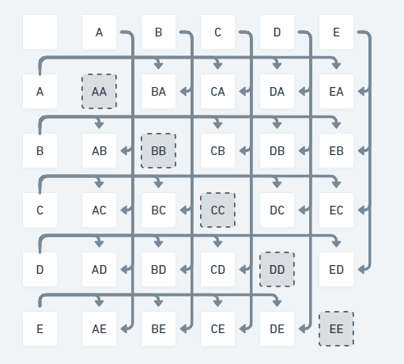
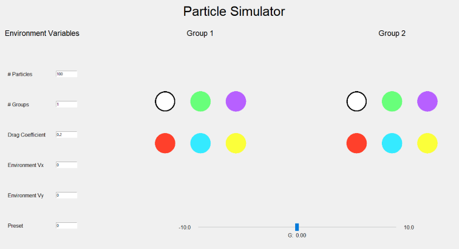
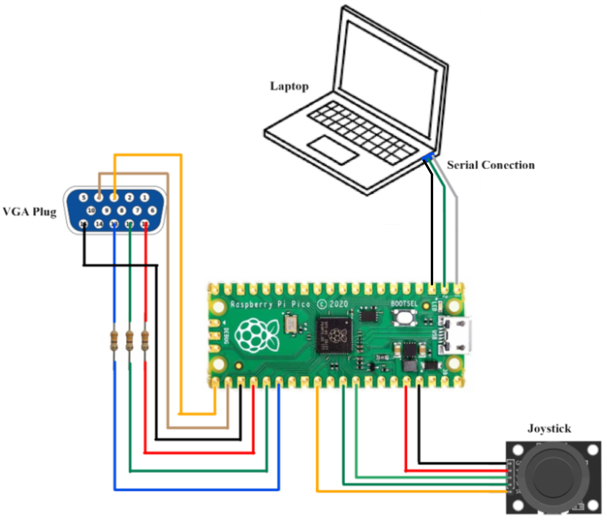

# Clusters
## Simulating the Microlife, Macrolife, and the Galaxy
### Made by **Aymen Kabel (ahk86), Adeniyi Fagbewesa (amf349), Ashley Heckman (agh93)**
<br>

# Introduction

Our project is a particle simulation controller that uses a graphical interface and a joystick to interact with a user-defined set of particle interactions.

For the final project, our goal was to simulate unique particle interactions using a clustering algorithm that operates at a speed of at least 20 FPS. There are user-defined sets of particles (groups) that all share the same properties.

The user has two ways to interact with the particles: they can use the interface to influence the particle interactions between each of the particle groups and they can use an interactive joystick to directly modify the positioning and behavior of the particles. The joystick controller is not meant for precise particle interactions, but to simulate a sudden disruptive external force entering the system. 
The result of these simple interactions ranged from a potentially distinctive clustering behavior to a chaotic, forever-moving behavior with no steady state. 

This project is intended to be an interactive plaything, but during testing we found several applications that it could be used for. While it could be used as a fun game for many people, it could also be used as an educational tool simulation. Although real life particles operate under more complicated equations, this simulation could still be used to demonstrate how atomic particles, and even how organic bodies, interact.

# High Level Design
 
 The motivations behind this final project were derived from Lab 2's particle lab that simulated the movement of animal groups. We were inspired by the surprisingly unique results that could arise from a set of relatively simple equations. As a result, we decided to create **Clusters**, which builds on the same idea of particle interactions, but generalizes the equations to display a much wider range of particle behaviors. We decided to use the interactive principles of gravity to achieve this goal. To have a set standard of correctness, we also used the following website online, which relies on similar principles: [Particle Life](https://hunar4321.github.io/particle-life/particle_life.html#191466468190960 "Particle Life"). Having a standard is important for a project like this because it is not entirely clear what the expected behavior should be at all times, even for the designers. By modifying our values to be the *theoretical* equivalent of *Particle Life's*, we could discern where potential errors might have been made.
 
## **Background Physics and Math**
 
In order to create our particle system, we needed an acute understanding of how forces are created between two masses and how those forces influence the moving behaviors of those bodies. The forces that we are considering in this closed environment are the forces of gravity and drag force. Both have nontrivial involvement towards the velocities and the positions of particles in the real world, as such, a physics and math background greatly expedited our implementation.

### <u>Gravitational Force</u>

It is said that 2 bodies of any mass exert the same gravitational force on one another. For example, as the Earth pulls down on us with gravity, we exert our own "gravity" on the Earth that pulls it up towards us. The force from us and the force from the Earth are exactly the same. The only significant difference is the change in speed (*acceleration*) that this same force causes on 1 body vs the other. We take advantage of this property to greatly simplify our calculations.

***

<div style="background-color:rgba(230, 230, 230, 0.85)">

***

 > 

 >  

***

</div>

> *Original gravitational force equation (above) and its reworked counterpart (below)*

If we take every particle's mass to be the same (1 for simplicity), we only need to modify the G constant so it accounts for that interaction between two masses. However, if the masses are the same *and* the forces are the same, then, the acceleration would be the same for two particles, no matter their true respective masses. To solve this, we simply allocate two G constants for the same interactions between 2 particles. As such, the gravitational constant of particle A on B will not be the same as B on A! By removing the bidirectional nature of force, we can combine the mass ratios of particle A, particle B, and the gravitational constant all into a single constant!

To take it a step further, we consider a force with linear decay with respect to distance as opposed to exponential decay. We could still portray similar behaviors even without an accurate decay rate, so we opted for this path for optimization.

### <u>Drag Force</u>

Drag force is the force that acts on bodies that do not travel in the same velocity as the environment. For example, if the velocity in an environment is 0, it will simply act against any type of motion. This can be seen with skydivers, whose bodies will eventually stop accelerating because the drag force acts against the force of gravity. This force depends on the drag coefficient, C, the density of the "fluid", p (air, water, a vacuum, etc), and the cross-sectional area, A, in the direction of the mass velocity, v. 


<div style="background-color:rgba(230, 230, 230, 0.85)">

***

 >  

 > 

***

</div>

> *Original drag force equation (above) and its reworked counterpart (below)*

As before, we can combine many of the constants into a single constant variable that represents the behavior of the entire environment. This suggests making the assumption that the particles all have the same area, but not much is lost in this assumption. Since we are displaying each particle with the same amount of pixels, this is much easier to visually accept. Furthermore, having the same area does not imply different masses, so it does not conceptually contradict the gravitational force manipulations.

We also removed the exponential factor from the velocity and made it linear instead. As before, this was done for optimization purposes and does not have huge ramifications on the visual behavior of the particles since this is a more secondary, reactive force.

***

## **Logical Structure**

The modifications to the fundamental physics equations above guided our program's control flow and our logical structure as seen below.



> A diagram of particle-to-particle interactions. The grayed out boxes are ignored interactions.

Our program uses each of the constants previously defined to change the state (position and velocity) of each particle. It does this by iterating through each particle in a twice-nested loop. First, each particle must check the distance between itself and the corresponding particle. If this distance is greater than a set visual range, then the interaction fails and the particle is unaffected by it. If it is within the acceptable range, then interaction calculations can proceed. Each particle is able to then "collect" the gravitational influence that the other particles impose on it and move to the correct x and y position accordingly.

As stated before, the interactions work in such a way such that the A->B interaction will look completely different from the B->A interaction. Particle A and particle B will each belong to a subclass of groups with their specified interactions with other groups. A and B could belong to different groups or potentially the same group with the same interaction! Furthermore, it is undefined behavior for a particle to interact with itself, so that situation is always ignored as well.

Like each particle, the joystick also has a "visual range". Whenever it is pressed, the particles inside this visual range will be immediately pushed outside its radius, ignoring any previously accumulated forces. We designed the joystick in this manner so the user could directly enter the *closed system* and add their own external forces. Furthermore, it was to have a way to precisely interrupt steady state behaviors to observe how the system recovers from external stimuli. 

***

## **Software Tradeoffs**

While implementing our optimizations to spawn more particles, we discovered that there was a very apparent tradeoff between accuracy and performance. For example, we eased the calculation rate of the particles such that for each iteration, a fraction of the particles would be ignored for calculations. This allows us to significantly improve our framerate, but as a result, the interactions between particles are loose and chaotic, at best.

The more calculations we forgo, the more loose the interactions are, until the particles appear to act independently of one another. Unlike previously observed, this situation prevents any type of steady state behavior such as clustering or equilibrium. We settled for a ratio of about one third. That is, 1 out of every 3 particles will not be considered for every iteration. This was the golden ratio that we acquired through trial and error. With one third ignored, we still saw the expected steady state patterns, but with the added benefit of being able to spawn **more** particles.

***

# UI Display



> Our finalized UI design, created in python. Each of the colors represents a valid group of particles. Changing the G slider on the bottom alters the group-to-group interactions of the particles. The values on the left changes the environmental variables as well as some environmental constants.

# Program and Hardware Design

We are running two programs for this project. One of these programs is a C program running on the Raspberry Pi Pico, and the other is a Python program running on a computer. The C program is responsible for doing all of the particle calculations, displaying the particles on the VGA screen, reading and incorporating the joystick values, and reading and incorporating values from the serial terminal. The Python program is responsible for running the GUI and sending any changes that the user makes to the C program through the serial terminal.

The C program uses two threads. The first thread draws the particles and the text on the VGA screen. It also reads and processes data from the serial port. The second thread performs all calculations for updating the positions and velocities of the particles. Since the two threads are doing very different things, we did not need to worry about any potential conflicts or safety violations in this design. It will never be the case that both threads attempt to read or write the same data at the same time.

The Python program launches a Tkinter GUI. It will send data through serial only when the user changes a value; if the user doesn't change a value, it won't send anything. We created a packet scheme for sending these changes. For each thing that the user can change, the GUI will send a letter corresponding to what the user wants to change, then a comma, then a number corresponding to what value the user has inputted. The gravitational variable is a little bit different since there are three values that need to be known. A table showing what is sent for each possible thing that can be changed is shown below. Note that we don't send the parenthesis; they are simply a good way to show that multiple words are one value. For example, if the user changes the number of particles to 50, then p,50\r will be sent over serial.

| Changed              | Sent Over Serial                                                 |
| :------------------- | :--------------------------------------------------------------- |
| Number of Particles  | p,(user inputted number of particles)\r                          |
| Number of Groups     | r,(user inputted number of groups)\r                             |
| Drag Coefficient     | d,(user inputted drag coefficient)\r                             |
| Vx Coefficient       | x,(user inputted Vx coefficient)\r                               |
| Vy Coefficient       | y,(user inputted Vy coefficient)\r                               |
| G Value              | g,(user group 1),(user group 2),(user G value)\r                 |
| Preset               | All of the above messages are sent with the stored preset values |

Getting the serial communication to work was one of the trickiest parts of this project. It took us a while to figure out that we needed to send the data from Python with a \r at the end of the line instead of a \n. Once we got that working, it was still a bit tricky to parse through the string. Luckily, we found some built in C function that did this for us, which made our jobs a lot easier.

Another tricky aspect of this project was dynamically increasing or decreasing the number of particles. We originally tried to create a new array of boids, copy over any boids that we wanted to keep from our existing array, spawn more boids in the new array if necessary, then delete our old array. We quickly realized that this did not work very well. Instead, we decided to create an array of particles with a length greater than what we planned to use. This way, we wouldn't have to increase or decrease the size of the array. If we want to increase the number of boids, we simply "spawn" a new boid, then increase our global variable for the number of boids. This will cause all calculation and drawing loops to include the new boids. If we want to decrease the number of boids, we erase the boid at its previously drawn position, then decrease the global variable for the number of boids. This causes all calculations and drawing loops to leave out the boids that we just erased since their index is beyond the global number of boids variable.

The last thing that gave us major difficulties was particles getting stuck on walls. We would start the animation, then the particles would quickly get sucked into one of the corners and stay there. We tried changing our limit speed, contain boid, and scatter boids functions but didn't have any success. Eventually, we tried increasing the turn factor to steer the particles away from the wall more aggressively. This fixed our problem.

On the hardware level of this project, we are using the Raspberry Pi Pico microcontroller to manage calculations in the particle simulation, as well as to manage inputs from the serial terminal and joystick, and to output to the VGA screen. The serial terminal has three outputs connected to the Pico: RX, TX and ground. These are connected to the two UART pins and the ground pin on the top left corner of the board. Note that the serial terminal does not need to connect to power, as we found this will have undesired effects on communication. We then used several GPIO pins to communicate pixel data from the Pico to the VGA display, bringing our particle simulation to life. We did not need to use all pins on the VGA port; we only used pins for red, green, blue, VSYNC, HSYNC and ground. Using a VGA graphics library for the Pico, we were able to use drawing functions to display particles at specific positions on the screen, as well as to print data that was useful for debugging purposes. Finally, we have a joystick connected to the Pico to control a cursor in the simulator. The joystick required five connections to the Pico: power (3.3V), ground, and three GPIO pins to communicate X and Y data as well as whether a built-in switch was pressed. Note that the two GPIO pins for the X and Y position of the joystick also needed to be analog pins, as the joystick would be communicating a range of voltages representing the stick's orientation. The switch for the joystick also needed to be connected to a pull-up resistor (power to switch), but this required no external components since they are programmable on the board. This was to ensure accurate readings from the switch by preventing a phenomenon in the pin connection known as "floating," where the Pico tries to read a pin with no connection (i.e. when the switch is open), creating an unstable state between high and low. A diagram of these hardware connections is shown below.



<br>

# Results

Our program can comfortably run 150 particles with any variable values. Once we cross 150, the animation may start to get jittery depending on what interaction values the particles are operating with. At 200 particles, it is clear that the animation is not behaving normally. It is very easy to see that the particles are "jumping." They no longer appear to be moving smoothly; you can watch a particle disappear then reappear. This happens when we get over the frame rate of 30 FPS. With some interactions, specifically those that cluster all of the particles together, we can get away with this because it's extremely difficult to pick out individual particles. However, for animations that don't cluster all particles, it is clear to see once we go way over the frame rate.

If the user tries to increase the number of particles to a value over 500, the program will crash. This is because we chose to make our particle array with length 500. When the program tries to access particle 501 (index 500) or later, it causes illegal indexing since our boid array is not that long. It would be very easy to bound the user input for the number of particles or to make the array longer, but we decided not to do so since there is no reason to be creating that many particles with our current configuration. The animation breaks down around 200 particles; going to 500 makes no sense. In the future, if we were to implement more optimizations that would increase the number of boids we could operate at 30 FPS, we would make the array larger. Right now, there is no need to do so.

We found some really cool behaviors when experimenting with different interaction values for our project. One such behavior was a cell-like structure that had behavior that was generally steady-state, as seen in our demo video [starting at 9:40](https://youtu.be/vJPbM3p8Gx0?t=580 "steady-state demo"). This behavior occurs when the majority of particles want to get away from each other, which causes a type of gridlock.

Another cool behavior was a chasing effect, as seen in our demo video [starting at 4:15](https://youtu.be/vJPbM3p8Gx0?t=255 "chasing demo"). This behavior occurred when group 1 was attracted to itself but wanted to get away from everyone else. Group 2 was attracted to itself and to group 1, so it chased group 1. Group 3 was attracted to itself and to group 2, so it chased group 2. This created a line of three groups that were chasing each other.

We also discovered a cool orbiting behavior, as seen in our demo video [starting at 4:00](https://youtu.be/vJPbM3p8Gx0?t=240 "orbiting demo"). This behavior was pretty similar to the chasing behavior with minor differences. For the chasing behavior, group 1 (the line leader) wanted to get away from everyone except itself. In the orbiting behavior, group 1 is attracted to group 3 but group 3 wants to get away from group 1. This creates a cool circling behavior, as group 1 chases group 3, group 3 chases group 2, and group 2 chases group 1.

This project was intended to be used as an interactive plaything, but during testing we found several more applications that it could be used for. It can certainly still be used as a fun game for many people, but it can also be used as an educational simulation tool. Although real life particles operate under more complicated equations, this simulation could still be used to demonstrate how atomic particles, and even how organic bodies, interact. This is a simplified model of complex real-life interactions.


# Conclusion

Our results were very much in tune with our defined expectations at the beginning. Our primary goal at the beginning was to create the particle simulator, develop a friendly UI interface, and then incorporate further interactive elements such as a joystick. Even at the time, we understood that with this experimental type of particle simulation, foreseeing how the particles would interact beforehand was unreasonable. As a result, one of our final goals was simply to optimize the simulation to the best as feasibly possible and to spawn as many particles as possible while retaining minimal lag.

There are many directions we could extend this project. We had many additional *stretch* goals that we did not get a chance to implement. If we were to extend this project, we would first complete the stretch goal of implementing radio frequency communication. Although this requires no additional changes to the particle implementation, it would challenge us to change from a UI interface to a RF remote interface. Our second stretch goal was implementing a 2 player game that would use 2 joysticks to "catch" the particles - whoever acquired more particles at the end would win. Our motivations for turning this project into a game is because of the inherently unpredictable nature of the particles. It would make every new experience fun and refreshing. Given a chance to do this project again, we would steer in a direction that allowed for more user interaction, like a game.

There are no intellectual property concerns involving our project. Every source of inspiration has been properly cited and one is even open sourced. Likewise, there are also no safety concerns regarding our design. The only exposed metal consists of 3 resistors and they have been properly shortened to avoid contact. Furthermore, they do not conduct large flows of current.

We conclude with a disclaimer that this project is not meant to accurately mimic a real-life closed system. It cannot be used as reliable proof or evidence in any academic or research setting. This project is purely experimental and is intended for purely visual effects.


# Appendix A (Permissions)

The group approves this report for inclusion on the course website.

The group approves [the video](https://youtu.be/vJPbM3p8Gx0 "demo") for inclusion on the course youtube channel.

# Appendix B (Code)

### Animation.c: Running on the Raspberry Pi Pico
```c
/**
 * Ashley Heckman (agh93@cornell.edu), Adeniyi Fagbewesa (amf349@cornell.edu), Aymen Kabel (ahk86@cornell.edu)
 * Staring point was lab 2 code from Hunter Adams (vha3@cornell.edu)
 * 
 * Particle Simulator
 * Do calculations on Core 0
 * Draw/Erase Particles and Text on Core 1
 *
 *
 * HARDWARE CONNECTIONS
 *  - GPIO 16 ---> VGA Hsync
 *  - GPIO 17 ---> VGA Vsync
 *  - GPIO 18 ---> 330 ohm resistor ---> VGA Red
 *  - GPIO 19 ---> 330 ohm resistor ---> VGA Green
 *  - GPIO 20 ---> 330 ohm resistor ---> VGA Blue
 *  - RP2040 GND ---> VGA GND & Joystick GND
 *  - GPIO 22 ---> Joystick SW
 *  - GPIO 27 ---> Joystick VRx
 *  - GPIO 26 ---> Joystcik VRy
 *  - RP2040 3v3 ---> Joystick Vcc
 *  - GP0 ---> TX (Serial)
 *  - GP1 ---> RX (Serial)
 *
 * RESOURCES USED
 *  - PIO state machines 0, 1, and 2 on PIO instance 0
 *  - DMA channels 0, 1
 *  - 153.6 kBytes of RAM (for pixel color data)
 *
 */

// Include the VGA grahics library
#include "vga_graphics.h"
// Include standard libraries
#include <stdio.h>
#include <stdlib.h>
#include <math.h>
#include <string.h>
// Include Pico libraries
#include "pico/stdlib.h"
#include "pico/divider.h"
#include "pico/multicore.h"
// Include hardware libraries
#include "hardware/pio.h"
#include "hardware/dma.h"
#include "hardware/clocks.h"
#include "hardware/pll.h"
#include "hardware/adc.h"
// Include protothreads
#include "pt_cornell_rp2040_v1.h"

// === the fixed point macros ========================================
typedef signed int fix15;
#define multfix15(a, b) ((fix15)((((signed long long)(a)) * ((signed long long)(b))) >> 15))
#define float2fix15(a) ((fix15)((a)*32768.0)) // 2^15
#define fix2float15(a) ((float)(a) / 32768.0)
#define absfix15(a) abs(a)
#define int2fix15(a) ((fix15)(a << 15))
#define fix2int15(a) ((int)(a >> 15))
#define char2fix15(a) (fix15)(((fix15)(a)) << 15)
#define divfix(a, b) (fix15)(div_s64s64((((signed long long)(a)) << 15), ((signed long long)(b))))

// Return the largest magnitude
fix15 maxMag(fix15 a, fix15 b)
{
  if (abs(fix2int15(a)) >= abs(fix2int15(b)))
  {
    return int2fix15(abs(fix2int15(a)));
  }
  return int2fix15(abs(fix2int15(b)));
}

// Return the smallest magnitude
fix15 minMag(fix15 a, fix15 b)
{
  if (abs(fix2int15(a)) <= abs(fix2int15(b)))
  {
    return int2fix15(abs(fix2int15(a)));
  }
  return int2fix15(abs(fix2int15(b)));
}

// uS per frame
#define FRAME_RATE 33000

#define button_pin 22 // for joystick button press

// Boid struct
typedef struct boid
{
  fix15 x; // newly calculated x position
  fix15 y; // newly calculated y position
  fix15 drawn_x; // previously drawn x - ensures that program erases proper position
  fix15 drawn_y; // previously drawn y - ensures that program erases proper position
  fix15 vx; // x velocity
  fix15 vy; // y velocity
  volatile int group; // group that boid is in (0-5)
} boid;

// Cursor/joystick struct
typedef struct cursor
{
  fix15 x; // x position
  fix15 y; // y position
  int r; // base radius of cursor circle
  int drawn_r; // drawn radius of cursor circle
  fix15 drawn_x; // previously drawn x - ensures that program erases proper position
  fix15 drawn_y; // previously drawn y - ensures that program erases proper position
} cursor;

// Alpha max + beta min parameters
fix15 alpha = float2fix15(0.960433870103); // 2cos(pi/8) / (1 + cos(pi/8))
fix15 beta = float2fix15(0.397824734759);  // 2sin(pi/8) / (1 + cos(pi/8))

// Turnfactor that will repel particles from walls
fix15 turnfactor = float2fix15(0.2);

// Visual range of the particles - will not interact with particles outside this distance
fix15 visualRange = float2fix15(100);

// Environmental Variables
fix15 G = float2fix15(-10.0);
fix15 p = float2fix15(0.0);
fix15 env_vx = float2fix15(0.0);
fix15 env_vy = float2fix15(0.0);

// Array of boids: initialized to size 500 which is way over the maximum our program can nicely support
// Makes "spawning" new boids and "destroying" extra boids a lot easier
int num_boids = 10;
boid boids[500];

// Number of groups
int num_groups = 1;

// Joystick display structure
cursor joystick;

// Is 1 if button is pressed down, 0 otherwise
int button_hold;

// Gravity values between the different groups
fix15 gs[6][6];

// Initialize all G variables between groups to 0.5
void initGs()
{
  for (int i = 0; i < 4; i++)
  {
    for (int j = 0; j < 4; j++)
    {
      gs[i][j] = float2fix15(0.5);
    }
  }
}

// Update the position of the cursor based on joystick inputs
void updateCursor()
{
  // Read the y value input
  adc_select_input(0);
  uint y_raw = adc_read();

  // Read the x value input
  adc_select_input(1);
  uint x_raw = adc_read();

  int speed = int2fix15(5); // speed that joystick will move at

  button_hold = !gpio_get(button_pin); // determine if button is pressed down

  // Update cursor position if joystick moved left/right/up/down
  if (x_raw > 3000) // right
    joystick.x = minMag(joystick.x + speed, int2fix15(590));
  else if (x_raw < 1000) // left
    joystick.x = maxMag(joystick.x - speed, int2fix15(50));

  if (y_raw > 3000) // down
    joystick.y = minMag(joystick.y + speed, int2fix15(430));
  else if (y_raw < 1000) // up
    joystick.y = maxMag(joystick.y - speed, int2fix15(50));
}


// Create/spawn a boid
void spawnBoid(boid *b, int group)
{
  srand(time_us_32()); // Set seed based on time of the system - makes more random
  
  // Randomly choose initial x position
  b->x = int2fix15(270 + (rand() % 100));
  // Randomly choose initial y position
  b->y = int2fix15(190 + (rand() % 100));

  // Randomly choose x velocity
  b->vx = int2fix15(-6 + (rand() % 13));
  // Randomly choose y velocity
  b->vy = int2fix15(-6 + (rand() % 13));

  // Boid group (groups will be split evenly, done through passing in group number)
  b->group = group;

  // Initial velocity if either velocity is initialized to 0
  if (b->vx == 0)
  {
    b->vx = int2fix15(3);
  }
  if (b->vy == 0)
  {
    b->vy = int2fix15(3);
  }
}


// Increase the number of boids to num
void increase_num_boids(int num)
{
  // Spawn the proper number of new boids
  for (int i = num_boids; i < num; i++)
  {
    spawnBoid(&boids[i], i % num_groups);
  }

  // Update the total number of boids
  num_boids = num;
}


// Decrease the number of boids to num
void decrease_num_boids(int num)
{
  // Erase the extra boids at their previously drawn positions
  for (int i = num; i < num_boids; i++)
  {
    drawRect(fix2int15(boids[i].drawn_x), fix2int15(boids[i].drawn_y), 2, 2, BLACK);
  }

  // Update the number of boids variable
  num_boids = num;
}

// Contain boid to on the VGA screen (640x480). We contain to a little smaller than that: 540x380, centered on VGA
void containBoid(boid *b)
{

  // Limit in the x direction
  if (b->x <= int2fix15(50) && b->vx < 0)
  {
    b->vx = -b->vx;
  }
  else if (b->x >= int2fix15(590) && b->vx > 0)
  {
    b->vx = -b->vx;
  }

  // Limit in the y direction
  if (b->y <= int2fix15(50) && b->vy < 0)
  {
    b->vy = -b->vy;
  }
  else if (b->y >= int2fix15(430) && b->vy > 0)
  {
    b->vy = -b->vy;
  }
}

// Variables to keep track of joystick scattering
fix15 dx_joy;
fix15 dy_joy;
fix15 dist_joy;
fix15 visRangeJoy = int2fix15(100);

// Scatter boids around joystick if it's pressed
void scatterBoid(boid *b)
{

  // If button is not pressed, don't do anything
  if (!button_hold)
    return;

  // Compute distance of the particle from the joystick
  dx_joy = b->x - joystick.x;
  dy_joy = b->y - joystick.y;

  // Alpha max + beta min to compute distance based on dx and dy values
  dist_joy = (multfix15(alpha, maxMag(dx_joy, dy_joy)) + multfix15(beta, minMag(dx_joy, dy_joy)));

  // If the particle is in the visual range of the cursor, move it away
  if (dist_joy < visRangeJoy)
  {
    b->vx += multfix15(dx_joy, int2fix15(10));
    b->vy += multfix15(dy_joy, int2fix15(10));
  }
}

fix15 boid_speed;
fix15 maxspeed = int2fix15(10);

// Limit boid speed
void limitBoid(boid *b)
{

  // Compute the speed of the particle using alpha max + beta min
  boid_speed = (multfix15(alpha, maxMag(b->vx, b->vy)) + multfix15(beta, minMag(b->vx, b->vy)));

  // If its speed is greater than maxspeed, slow it down
  if (boid_speed > maxspeed)
  {
    b->vx = multfix15(divfix(b->vx, boid_speed), maxspeed);
    b->vy = multfix15(divfix(b->vy, boid_speed), maxspeed);
  }
}

// Stores all of the user input
int user_mode;
int num_boids_in;
int num_groups_in;
int user_mode_2;
int user_group1;
int user_group2;
float user_value;
char str[20];
// ==================================================
// === users serial input thread
// ==================================================
static PT_THREAD(protothread_serial(struct pt *pt))
{

  PT_BEGIN(pt);
  // wait for 0.1 sec
  PT_YIELD_usec(1000000);
  // announce the threader version
  sprintf(pt_serial_out_buffer, "Protothreads RP2040 v1.0\r\n");
  // non-blocking write
  serial_write;

  while (1)
  {
    // Read from serial and save that data
    serial_read;
    sscanf(pt_serial_in_buffer, "%s", &str);
    char *inst = strtok(str, ",");

    // If the string starts with b, we need to update the number of boids
    if (!strcmp(inst, "b"))
    {
      // Get the new number of boids that we want
      num_boids_in = atoi(strtok(NULL, ","));

      // Call increase/decrease num boids to reflect this change in the number of boids
      if (num_boids > num_boids_in)
      {
        decrease_num_boids(num_boids_in);
      }
      else
      {
        increase_num_boids(num_boids_in);
      }
    }

    // If the string starts with r, we need to update the number of groups
    else if (!strcmp(inst, "r"))
    {
      num_groups = atoi(strtok(NULL, ","));
      
      // Change the groups of the existing boids - boids will be evenly split between the groups
      for (int i = 0; i < num_boids; i++)
      {
        boids[i].group = (i % num_groups);
      }
    }

    // If the string starts with d, we need to update the drag coefficient
    else if (!strcmp(inst, "d"))
    {
      // Update the global variable for drag
      p = float2fix15(atof(strtok(NULL, ",")));
    }

    // If the string starts with x, we need to update the environmental vx
    else if (!strcmp(inst, "x"))
    {
      // Update the environmental vx variable
      env_vx = float2fix15(atof(strtok(NULL, ",")));
    }

    // If the string starts with y, we need to update the environmental vy
    else if (!strcmp(inst, "y"))
    {
      // Update the environmental vy variable
      env_vy = float2fix15(atof(strtok(NULL, ",")));
    }
    
    // If the string starts with g, we need to update the gravitational attraction between two groups
    else if (!strcmp(inst, "g"))
    {
      user_group1 = atoi(strtok(NULL, ",")); // get first group
      user_group2 = atoi(strtok(NULL, ",")); // get second group
      user_value = atof(strtok(NULL, ",")); // get g value
      
      // Update the g value between the 2 groups with the new value
      gs[user_group1][user_group2] = float2fix15(user_value);
    }

    else
    {
      // wtf bro
    }

  } // END WHILE(1)
  PT_END(pt);
} // timer thread

fix15 dx;
fix15 dy;
fix15 dvx;
fix15 dvy;
fix15 dist_squared;
fix15 d;
fix15 FG;
fix15 FD;
int core0_frame_rate;
int cycle_num = 0; // 0 - 2, determines start value
int start_pos = 0; // first boid to do calculations on

// Animation on core 0
static PT_THREAD(protothread_animCalc(struct pt *pt))
{
  // Mark beginning of thread
  PT_BEGIN(pt);

  // Variables for maintaining frame rate
  static int begin_time;
  static int spare_time;
  static int other_boid;
  static int cur_boid;
  static int skip = 0;

  // Spawn and initialize boids on core0
  for (int i = 0; i < num_boids; i++)
  {
    spawnBoid(&boids[i], i % num_groups);
  }

  // Initialize the cursor at its initial position
  joystick.x = int2fix15(320);
  joystick.y = int2fix15(240);
  joystick.r = 10;

  // Initialize the G variables
  initGs();

  while (1)
  {
    // Measure time at start of thread
    begin_time = time_us_32();

    // Update the cursor position
    updateCursor();

    // Update which particles to skip in this iteration
    skip = ( skip + 1 ) % 3;

    // Update every the particle positions
    for (cur_boid = 0; cur_boid < num_boids; cur_boid++)
    {

      // Start each iteration with 0 velocity
      boids[cur_boid].vx = 0;
      boids[cur_boid].vy = 0;


      if (cur_boid % 3 != skip) { // If true, don't perform calculations for this boid

        // Compare against all other particles
        for (other_boid = 0; other_boid < num_boids; other_boid++)
        {
          // Don't compare against itself
          if (cur_boid == other_boid)
            continue;

          // Compute differences in x, y coordinates
          dx = boids[cur_boid].x - boids[other_boid].x;
          dy = boids[cur_boid].y - boids[other_boid].y;

          // Compute distance between particles
          d = multfix15(maxMag(dx, dy), alpha) + multfix15(minMag(dx, dy), beta);
          
          // Get the G value between the 2 particles that are currently being compared
          G = gs[boids[cur_boid].group][boids[other_boid].group];

          // Compute the gravitational force on the particles
          FG = divfix(G, d);

          // Are the differences less than the visual range? If so, update the current boid's velocity
          if (d < visualRange)
          {
            boids[cur_boid].vx += multfix15(FG, dx);
            boids[cur_boid].vy += multfix15(FG, dy);
          }
        }
      }

      // Environmental vx and vy contributions
      boids[cur_boid].vx -= multfix15(p, boids[cur_boid].vx - env_vx);
      boids[cur_boid].vy -= multfix15(p, boids[cur_boid].vy - env_vy);

      // Keep boid on the screen
      containBoid(&boids[cur_boid]);

      // Scatter boids if button is pressed
      scatterBoid(&boids[cur_boid]);

      // Enforce maximum speed limit on the boids
      limitBoid(&boids[cur_boid]);

      // Update the position of each boid
      boids[cur_boid].x = boids[cur_boid].x + boids[cur_boid].vx;
      boids[cur_boid].y = boids[cur_boid].y + boids[cur_boid].vy;

    }

    // delay in accordance with frame rate
    spare_time = FRAME_RATE - (time_us_32() - begin_time);
    core0_frame_rate = (time_us_32() - begin_time);

    // yield for necessary amount of time
    PT_YIELD_usec(spare_time);
    // NEVER exit while
  } // END WHILE(1)
  PT_END(pt);
} // animation thread

// Animation on core 1
int cur_boid_draw = 0;
static PT_THREAD(protothread_animDraw(struct pt *pt))
{
  // Mark beginning of thread
  PT_BEGIN(pt);

  // Variables for maintaining frame rate
  static int begin_time;
  static int spare_time;

  while (1)
  {
    // Measure time at start of thread
    begin_time = time_us_32();

    // Draw variable =
    setTextColor(WHITE);
    setTextSize(1);
    setCursor(5, 15);
    writeString("Frame Rate: ");
    setCursor(5, 5);
    writeString("Elapsed Time: ");

    // Erase then redraw all of the boids
    for (cur_boid_draw = 0; cur_boid_draw < num_boids; cur_boid_draw++)
    {
      // Erase the current boid at its previously drawn position
      drawRect(fix2int15(boids[cur_boid_draw].drawn_x), fix2int15(boids[cur_boid_draw].drawn_y), 2, 2, BLACK);

      // Update the old drawn values with the new values that will be drawn
      boids[cur_boid_draw].drawn_x = boids[cur_boid_draw].x;
      boids[cur_boid_draw].drawn_y = boids[cur_boid_draw].y;

      // Draw the boid at its new position - color is based on what group boid is in
      if (boids[cur_boid_draw].group == 0)
      {
        drawRect(fix2int15(boids[cur_boid_draw].drawn_x), fix2int15(boids[cur_boid_draw].drawn_y), 2, 2, WHITE);
      }
      else if (boids[cur_boid_draw].group == 1)
      {
        drawRect(fix2int15(boids[cur_boid_draw].drawn_x), fix2int15(boids[cur_boid_draw].drawn_y), 2, 2, RED);
      }
      else if (boids[cur_boid_draw].group == 2)
      {
        drawRect(fix2int15(boids[cur_boid_draw].drawn_x), fix2int15(boids[cur_boid_draw].drawn_y), 2, 2, GREEN);
      }
      else if (boids[cur_boid_draw].group == 3)
      {
        drawRect(fix2int15(boids[cur_boid_draw].drawn_x), fix2int15(boids[cur_boid_draw].drawn_y), 2, 2, CYAN);
      }
      else if (boids[cur_boid_draw].group == 4)
      {
        drawRect(fix2int15(boids[cur_boid_draw].drawn_x), fix2int15(boids[cur_boid_draw].drawn_y), 2, 2, MAGENTA);
      }
      else if (boids[cur_boid_draw].group == 5)
      {
        drawRect(fix2int15(boids[cur_boid_draw].drawn_x), fix2int15(boids[cur_boid_draw].drawn_y), 2, 2, YELLOW);
      }
    }

    // Erase the cursor at its old position
    drawCircle(fix2int15(joystick.drawn_x), fix2int15(joystick.drawn_y), joystick.drawn_r, BLACK);

    // Update the old drawn values with the new drawn values
    joystick.drawn_x = joystick.x;
    joystick.drawn_y = joystick.y;
    joystick.drawn_r = joystick.r + (button_hold ? 5 : 0);

    // Draw the cursor at its new position - cyan if pressed, red if not pressed
    if (button_hold)
    {
      drawCircle(fix2int15(joystick.drawn_x), fix2int15(joystick.drawn_y), joystick.drawn_r, CYAN);
    }
    else
    {
      drawCircle(fix2int15(joystick.drawn_x), fix2int15(joystick.drawn_y), joystick.drawn_r, RED);
    }

    // Used to write elapsed time on screen
    static char e_time_text[40];
    sprintf(e_time_text, "%d", (int)(time_us_32() / 1000000));

    // Used to write time to update boids on screen
    static char w_time_text[40];
    sprintf(w_time_text, "%d", (int)(divfix(core0_frame_rate, int2fix15(1000))));

    // Print stuff to the VGA
    fillRect(85, 5, 50, 10, BLACK);
    fillRect(70, 15, 30, 10, BLACK);
    setTextSize(1);
    setCursor(85, 5);
    writeString(e_time_text);

    // Display frame rate in red if we're over timing
    if ((FRAME_RATE - core0_frame_rate) < 0)
    {
      setTextColor(RED);
    }
    setCursor(75, 15);
    writeString(w_time_text);

    // delay in accordance with frame rate
    spare_time = FRAME_RATE - (time_us_32() - begin_time);

    // yield for necessary amount of time
    PT_YIELD_usec(spare_time);
    // NEVER exit while
  } // END WHILE(1)
  PT_END(pt);
} // animation thread

// ========================================
// === core 1 main -- started in main below
// ========================================
void core1_main()
{
  // Add animation thread
  pt_add_thread(protothread_animDraw);
  // Add serial thread
  pt_add_thread(protothread_serial);
  // Start the scheduler
  pt_schedule_start;
}

// ========================================
// === main
// ========================================
// USE ONLY C-sdk library
int main()
{
  // Overclocking
  bool set = set_sys_clock_khz(250000, true);
  if (!set)
  {
    printf("Could not overclock\r\n");
  }

  // initialize stio
  stdio_init_all();

  // initialize adc
  adc_init();
  // Make sure GPIO is high-impedance, no pullups etc
  // Joystick Vx and Vy use these
  adc_gpio_init(26);
  adc_gpio_init(27);

  // Setup joystcik button press and pico led pin
  gpio_pull_up(button_pin);
  gpio_init(PICO_DEFAULT_LED_PIN);
  gpio_set_dir(PICO_DEFAULT_LED_PIN, GPIO_OUT);

  // initialize VGA
  initVGA();

  // start core 1
  multicore_reset_core1();
  multicore_launch_core1(&core1_main);

  // add threads
  pt_add_thread(protothread_animCalc);

  // start scheduler
  pt_schedule_start;
}
```

### UI_code.py: Running on Computer

```python
import tkinter as tk
from tkinter import ttk
from functools import partial
import serial
import random

# Change SERIAL PORT as needed
ser = serial.Serial(
  baudrate = 115200,
  port = "COM3"
)

# Size of spawned window
window_w = 1200
window_h = 800


# root window
root = tk.Tk()
root.geometry(str(window_w) + 'x' + str(window_h))
root.resizable(True, True)
root.title('Particle Simulator')

# Configure root grid
root.columnconfigure(0, weight = 2)
root.columnconfigure(1, weight = 3)
root.columnconfigure(2, weight = 3)

root.rowconfigure(0, weight = 2)
root.rowconfigure(1, weight = 1)
root.rowconfigure(2, weight = 4)
root.rowconfigure(3, weight = 2)


# slider current value
current_value = tk.DoubleVar()


def get_current_value():
    return '{:.2f}'.format(current_value.get())
  
# Write an encoded message to serial (adds \r)
def write_serial(s):
  ser.write((s + '\r').encode())

# slider changed event
def slider_changed(event = None):
  val = get_current_value()
  value_label.configure(text="G: " + val)
  Gs[current_group_0][current_group_1] = val
  bitstring = "g," + str(current_group_0) + "," + str(current_group_1) + "," + str(val)
  write_serial(bitstring)


slider_UI_len = 600
slider_UI_ratio = slider_UI_len / window_w

# G slider

slider_min = -20.0
slider_max = 20.0

slider_frame = ttk.Frame(root)
slider_frame.grid(
  column = 1,
  row = 3,
  columnspan = 2,
)
slider_frame.columnconfigure(0,weight = 1)
slider_frame.columnconfigure(1,weight = 10)
slider_frame.columnconfigure(2,weight = 1)

slider_label = ttk.Label(
  slider_frame,
  text = slider_min,
  font = ('', 12),
)
slider_label.grid(column = 0, row = 0)

slider_label = ttk.Label(
  slider_frame,
  text = slider_max,
  font = ('', 12),
)
slider_label.grid(column = 2, row = 0)

slider = ttk.Scale(
    slider_frame,
    from_=slider_min,
    to=slider_max,
    orient='horizontal',
    command=slider_changed,
    length = slider_UI_len,
    variable=current_value
)
slider.grid(column=1, row = 0, padx = 20)


# value label - displays G value
value_label = ttk.Label(
    slider_frame,
    text="G: " + get_current_value(),
    font = ('', 12)
)
value_label.grid(
    row=1,
    column=1,
)


# TITLE label
title_label = ttk.Label(
    root,
    text='Particle Simulator',
    font = ('', 30),
)
title_label.grid(
    row = 0,
    column = 0,
    columnspan=3,
)

################################################################################
# ENVIRONMENT VARIABLES
################################################################################

# ENV VAR label
env_var_label = ttk.Label(
    root,
    text='Environment Variables',
    font = ('', 17),
)
env_var_label.grid(
    row = 1,
    column = 0,
    columnspan=1,
)

# Send these over Serial!
n_particles = 100
n_groups    = 1
drag_coef   = 0.2
env_vx      = 0
env_vy      = 0

# Input events!

def n_particles_change():
  i = int(n_particles_var.get())
  global n_particles
  n_particles = i
  bitstring = "b," + str(n_particles)
  write_serial(bitstring)
  
    
def n_groups_change():
  i = int(n_groups_var.get())
  global n_groups
  n_groups = min(abs(i), num_groups)
  bitstring = "r," + str(n_groups)
  write_serial(bitstring)
  
  for group_offset in range (0,num_groups + 1,num_groups):
    for i in range(num_groups):
      b = buttons[group_offset + i]
      b.config(state = "disable" if i >= n_groups else "normal")
  
def drag_coef_change():
  i = float(drag_coef_var.get())
  global drag_coef
  drag_coef = i
  bitstring = "d," + str(drag_coef)
  write_serial(bitstring)

def env_vx_change():
  i = float(env_vx_var.get())
  global env_vx
  env_vx = i
  bitstring = "x," + str(env_vx)
  write_serial(bitstring)

  
def env_vy_change():
  i = float(env_vy_var.get())
  global env_vy
  env_vy = i
  bitstring = "y," + str(env_vy)
  write_serial(bitstring)
  

# Annoying that its here ik ik
# When a circle is clicked, change active group
def button_clicked(group, idx):
  group_offset = group * num_groups
  for i in range(num_groups):
    b = buttons[group_offset + i]
    b.config(image = circle_images[i])
    
  global current_group_0
  global current_group_1
  
  current_group_0 = idx if group == 0 else current_group_0
  current_group_1 = idx if group == 1 else current_group_1
  
  slider.set(Gs[current_group_0][current_group_1])
  slider_changed()
  
  b = buttons[group_offset + idx]
  b.config(image = select_images[idx])
  
  
# presets discovered so far, feel free to add more!!
presets = [
  
  {
  "vars" : {
    "n_particles_var" : 200,
    "n_groups_var"    : 2,
    "drag_coef_var"   : 0,
    "env_vx_var"      : 0,
    "env_vy_var"      : 0,
  },
  
  "Gs" : [
    [-0.95, 2.78],
    [-3.61, -2.36],
    ],
  },
  
  {
  "vars" : {
    "n_particles_var" : 150,
    "n_groups_var"    : 3,
    "drag_coef_var"   : 0,
    "env_vx_var"      : 0,
    "env_vy_var"      : -2,
  },
  
  "Gs" : [
    [-10, 5,   -10],
    [5,   2,   10 ],
    [2,   10,  -10],
    ],
  },
  
    {
    
  "vars" : {
    "n_particles_var" : 200,
    "n_groups_var"    : 4,
    "drag_coef_var"   : 0.7,
    "env_vx_var"      : 0,
    "env_vy_var"      : 0,
  },
  
  "Gs" : [
    [-4, 10, -7.2, 7.8],
    [6, 8.6, 1.2, 0.8],
    [-8.5, -7, -6.7, -7],
    [-3.3, -10, -7.5, 9.5],
    ],
  },
  
  {
    
  "vars" : {
    "n_particles_var" : 176,
    "n_groups_var"    : 5,
    "drag_coef_var"   : 0,
    "env_vx_var"      : -1.5,
    "env_vy_var"      : -4.2,
  },
  
  "Gs" : [
    [-7.0, -8.2, 3.5, 19.8, -20.0, -17.1], 
    [2.0, 5.6, -11.7, -17.2, -9.1, 17.5], 
    [18.1, -19.7, 2.6, -17.9, 15.2, -11.4], 
    [-14.4, 15.6, -2.7, 9.5, -18.0, -9.1], 
    [11.2, -18.5, -6.2, 9.3, 19.2, 7.5], 
    [-8.7, 17.1, -10.4, -8.0, -13.4, 3.1]]
  },
  
    {
    
  "vars" : {
    "n_particles_var" : 164,
    "n_groups_var"    : 5,
    "drag_coef_var"   : 0,
    "env_vx_var"      : -1.5,
    "env_vy_var"      : -4.2,
  },
  
  "Gs" : [
    [-4.2, -2.5, -12.1, -8.8, 19.8, -5.5],
    [-5.9, -3.1, -3.0, 3.9, -14.8, 16.4],
    [4.1, -6.9, 9.5, 13.6, 8.8, 19.9],
    [12.4, 6.6, 12.6, -17.3, -16.4, -3.4],
    [-17.0, -4.8, 2.7, 8.6, 19.8, 15.8],
    [5.0, -16.6, 13.2, -5.3, 10.5, -11.8]]
  },
    
  {
    
  "vars" : {
    "n_particles_var" : 200,
    "n_groups_var"    : 5,
    "drag_coef_var"   : 0,
    "env_vx_var"      : -1.5,
    "env_vy_var"      : -4.2,
  },
  
  "Gs" : [[-15.9, -6.4, 9.5, -19.7, -5.8, 5.7],
     [6.9, -12.9, -12.6, 18.5, -8.4, 11.7],
     [7.3, -5.8, -4.0, 0.0, 16.4, -4.1],
     [18.8, -12.0, -17.5, 12.1, -2.2, 12.9],
     [-7.2, 0.0, -3.0, 7.2, 6.1, 3.2],
     [19.8, -12.8, -2.6, 15.1, 6.5, -18.4]]
  },
  
    {
    
  "vars" : {
    "n_particles_var" : 200,
    "n_groups_var"    : 4,
    "drag_coef_var"   : 0,
    "env_vx_var"      : -1.5,
    "env_vy_var"      : -4.2,
  },
  
  "Gs" : [
    [-17.2, 8.4, -2.0, -19.0, 14.1, -10.6],
    [4.8, 12.4, 8.7, -12.8, 12.8, 7.6],
    [-0.6, 13.3, -15.3, -15.9, 6.1, 16.3],
    [19.5, 17.6, 15.0, 13.1, -1.5, -16.7],
    [1.5, 13.7, -1.9, -7.9, 18.5, -11.2],
    [15.3, 17.5, -13.8, 10.1, -16.8, 0.0]] 
  },
    
  {
  
  "vars" : {
    "n_particles_var" : 180,
    "n_groups_var"    : 6,
    "drag_coef_var"   : 0,
    "env_vx_var"      : -1.5,
    "env_vy_var"      : -4.2,
  },
  
  "Gs" : [[19.9, 10.3, 4.7, 19.1, 1.2, 6.1],
          [-2.2, 7.4, -13.1, -9.7, 14.2, -0.7],
          [-15.6, -18.7, 1.8, 1.9, 6.4, -5.5],
          [12.8, -4.7, 19.3, -5.6, -14.9, -1.6],
          [12.5, 8.9, -0.6, 4.1, 2.0, 1.5],
          [16.1, -5.5, 18.0, 1.2, -15.6, -3.8]]
  },
  
]  

# preset variable change event, send EVERYTHING over serial (-1 = random)
def preset_change():
  p_i = int(preset_var.get())
  use_rand = p_i < 0
  p = presets[p_i if not use_rand else 0]
  
  # change all global environmental variables
  for i,v in enumerate(p["vars"]):
    all_vars[i].set(p["vars"][v])
    
  for i,v in enumerate(p["Gs"]):
    for j,w in enumerate(v):
      Gs[i][j] = w
    
  if use_rand: # randomize!!
    n_particles_var.set(random.randint(100,200))
    n_groups_var.set(random.randint(1,6))
    drag_coef_var.set(0 * random.randint(-100,100)/100)
    env_vx_var.set(random.randint(-100,100)/10)
    env_vy_var.set(random.randint(-100,100)/10)
    
    for i in range(6):
      for j in range(6):
        Gs[i][j] = random.randint(-200,200)/10
        
    print(Gs) #snapshot of random variables - can save for later
  
  # send environmental variables over serial
  for i in ENV_VARS:
    if i != "Preset":
      ENV_VARS[i]["fun"]()
        
  # Restart the buttons position to 0,0
  button_clicked(0,0)
  button_clicked(1,0)
  
  # send evertything over serial port
  for g0 in range(n_groups):
    for g1 in range(n_groups):
      val = Gs[g0][g1]
      bitstring = "g," + str(g0) + "," + str(g1) + "," + str(val)
      write_serial(bitstring)


# global environmental variables (tkinter variablees)

n_particles_var = tk.StringVar(value = str(n_particles))
n_groups_var    = tk.StringVar(value = str(n_groups))
drag_coef_var   = tk.StringVar(value = str(drag_coef))
env_vx_var      = tk.StringVar(value = str(env_vx))
env_vy_var      = tk.StringVar(value = str(env_vy))
preset_var      = tk.StringVar(value = "0")

all_vars = [n_particles_var, n_groups_var, drag_coef_var, env_vx_var, env_vy_var]

ENV_VARS = {
  "# Particles"       : {"var" : n_particles_var, "fun" : n_particles_change},
  "# Groups"          : {"var" : n_groups_var,    "fun" : n_groups_change},
  "Drag Coefficient"  : {"var" : drag_coef_var,   "fun" : drag_coef_change},
  "Environment Vx"    : {"var" : env_vx_var,      "fun" : env_vx_change},
  "Environment Vy"    : {"var" : env_vy_var,      "fun" : env_vy_change},
  "Preset"            : {"var" : preset_var,      "fun" : preset_change},
}

env_frame = ttk.Frame(root)
env_frame.grid(
  row = 2,
  column = 0,
  rowspan = 2,
)

env_frame.columnconfigure(0, weight = 7)
env_frame.columnconfigure(1, weight = 1)

# Important for impossible cases. Will not crash - protect software from user
def change_handler(env_name, h):
  try:
    ENV_VARS[env_name]["fun"]()
  except:
    return
  
# make environment variable UI elements
for i,var_name in enumerate(ENV_VARS):
    
  new_label = ttk.Label(
    env_frame,
    text=var_name,
    font = ('', 12),
  )
  new_label.grid(
    row = i,
    ipady= 35,
    ipadx= 15,
    sticky = 'w'
  )
  
  new_txtbox = tk.Entry(
    env_frame,
    width = 10,
    textvariable = ENV_VARS[var_name]["var"],
  )
  new_txtbox.grid(
    row = i,
    column = 1,
    sticky = 'e'
  )
  new_txtbox.bind('<Return>', partial(change_handler, var_name))
  


################################################################################
# GROUPS
################################################################################


# GR0UP 1 label
group1_label = ttk.Label(
    root,
    text='Group 1',
    font = ('', 17),
)
group1_label.grid(
    row = 1,
    column = 1,
    columnspan=1,
)

# GR0UP 2 label
group2_label = ttk.Label(
    root,
    text='Group 2',
    font = ('', 17),
)
group2_label.grid(
    row = 1,
    column = 2,
    columnspan=1,
)

# circle group images
white_circle = tk.PhotoImage(file = r"imgs\white_circle.png")
white_select = tk.PhotoImage(file = r"imgs\white_select.png")
blue_circle = tk.PhotoImage(file = r"imgs\blue_circle.png")
blue_select = tk.PhotoImage(file = r"imgs\blue_select.png")
green_circle = tk.PhotoImage(file = r"imgs\green_circle.png")
green_select = tk.PhotoImage(file = r"imgs\green_select.png")
purple_circle = tk.PhotoImage(file = r"imgs\purple_circle.png")
purple_select = tk.PhotoImage(file = r"imgs\purple_select.png")
red_circle = tk.PhotoImage(file = r"imgs\red_circle.png")
red_select = tk.PhotoImage(file = r"imgs\red_select.png")
yellow_circle = tk.PhotoImage(file = r"imgs\yellow_circle.png")
yellow_select = tk.PhotoImage(file = r"imgs\yellow_select.png")


circle_images = [
  white_circle,
  red_circle,
  green_circle,
  blue_circle,
  purple_circle,
  yellow_circle
]

# black outline = selected images
select_images = [
  white_select,
  red_select,
  green_select,
  blue_select,
  purple_select,
  yellow_select
]

# shrink the images and save them
for i in range(len(circle_images)):
  circle_images[i] = circle_images[i].subsample(9,9)
  select_images[i] = select_images[i].subsample(9,9)
  

buttons = [
  
]

num_groups = 6
Gs = [[0] * num_groups for _ in range(num_groups)]
current_group_0 = 0
current_group_1 = 0

# button clicked event
def button_clicked(group, idx):
  group_offset = group * num_groups
  for i in range(num_groups):
    b = buttons[group_offset + i]
    b.config(image = circle_images[i])
    
  global current_group_0
  global current_group_1
  
  current_group_0 = idx if group == 0 else current_group_0
  current_group_1 = idx if group == 1 else current_group_1
  
  slider.set(Gs[current_group_0][current_group_1])
  slider_changed()
  
  b = buttons[group_offset + idx]
  b.config(image = select_images[idx])
  

for group in range(0,2):
  group_frame = ttk.Frame(root)
  group_frame.grid(
    row = 2,
    column = group + 1,
  )
  
  for col_i in range(3):
    for row_i in range(2):
      idx = col_i*2 + row_i
      b = tk.Button(
        group_frame,
        height = 65,
        width = 65,
        image = circle_images[idx],
        borderwidth = 0,
        command = partial(button_clicked, group, idx),
      )
      b.grid(
        row = row_i,
        column = col_i,
        padx = 20,
        pady = 30,
      )
      buttons.append(b)
      
# whenever the screen size changes, possibly modify some UI elements to preserve ratio      
def updateUI(win):
  h = root.winfo_height()
  w = root.winfo_width()

# start with group 0, 0
button_clicked(0,0)
button_clicked(1,0)
  
# uncomment to enable updateUI
# root.bind('<Configure>', updateUI)

# start up the UI
root.mainloop()
```

# Appendix C (Work Distribution)

Most of the tasks were completed by working together. A breakdown of the project is listed below.

* **Configure the VGA:** Ashley, Adeniyi, Aymen
* **Spawn and unspawn particles:** Ashley
* **Add group interactions:** Aymen, Adeniyi
* **Add environmental variable interactions:** Ashley, Aymen, Adeniyi
* **Add support for multiple groups:** Ashley, Aymen, Adeniyi
* **Wire the joystick and read its values:** Aymen
* **Add movement of the joystick on VGA display:** Ashley, Aymen
* **Scatter boids away from joystick when it is pressed down:** Ashley, Aymen
* **Build the GUI:** Adeniyi
* **Create serial communication protocol:** Ashley, Aymen
* **Establish serial communication:** Adeniyi
* **Update variables in C and VGA display based on received data:** Ashley, Adeniyi, Aymen
* **Create website:** Ashley, Adeniyi, Aymen

# Appendix D (References)

Inspiration for the project came from the following sources:
* [Interactive Particle Simulation](https://hunar4321.github.io/particle-life/particle_life.html#191466468190960 "Interactive Simulation")
* [Simulation of Distinct Behaviors](https://www.ventrella.com/Clusters/ "Distinct Behaviors")

We used the following resources while completing our project:
* [Raspberry Pi Pico Pinout](https://datasheets.raspberrypi.com/pico/Pico-R3-A4-Pinout.pdf "Pico Pinout")
* [Hunter Adams' VGA Driver Webpage](https://vanhunteradams.com/Pico/VGA/VGA.html "VGA")
* [Pyserial Documentation](https://pyserial.readthedocs.io/en/latest/pyserial_api.html "Pyserial")