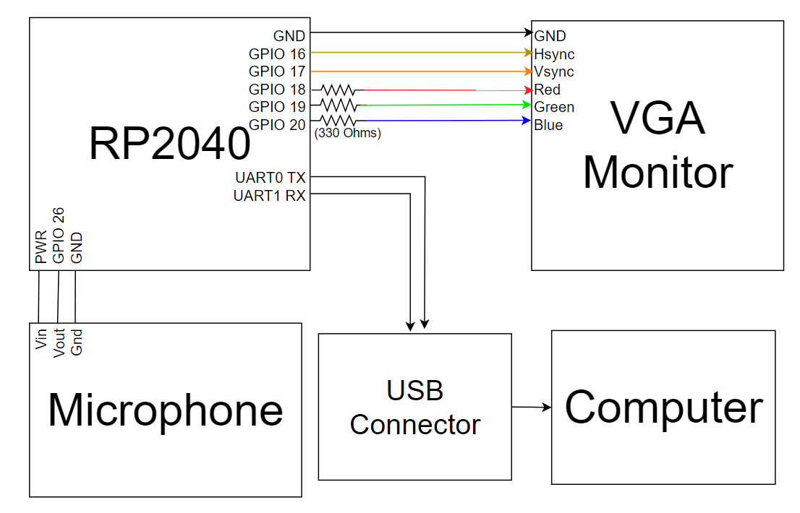
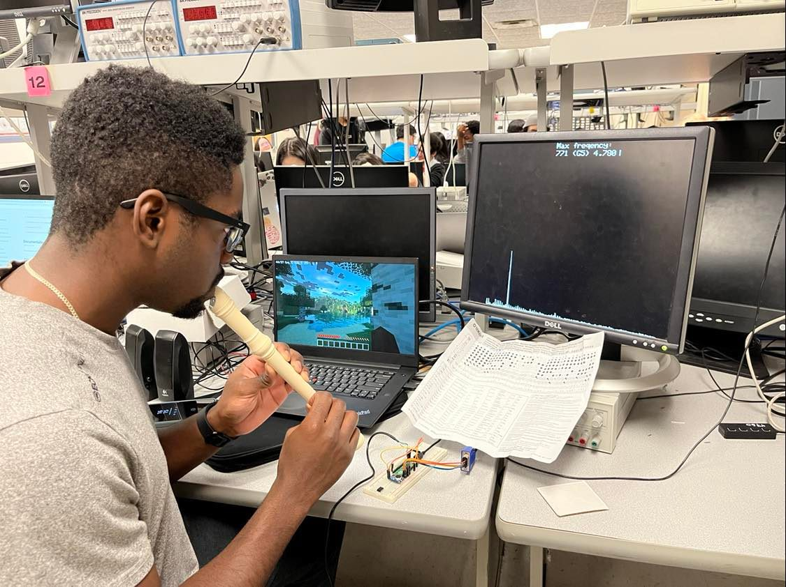

<!-----

You have some errors, warnings, or alerts. If you are using reckless mode, turn it off to see inline alerts.
* ERRORs: 0
* WARNINGs: 0
* ALERTS: 2

Conversion time: 0.749 seconds.

Using this Markdown file:

1. Paste this output into your source file.
2. See the notes and action items below regarding this conversion run.
3. Check the rendered output (headings, lists, code blocks, tables) for proper
   formatting and use a linkchecker before you publish this page.

Conversion notes:

* Docs to Markdown version 1.0β34
* Tue Dec 13 2022 05:03:33 GMT-0800 (PST)
* Source doc: Final Project Final Report
* This document has images: check for >>>>>  gd2md-html alert:  inline image link in generated source and store images to your server. NOTE: Images in exported zip file from Google Docs may not appear in  the same order as they do in your doc. Please check the images!

----->

<iframe width="560" height="315" src="https://www.youtube-nocookie.com/embed/rjc3P8-UGm8" title="YouTube video player" frameborder="0" allow="accelerometer; autoplay; clipboard-write; encrypted-media; gyroscope; picture-in-picture" allowfullscreen></iframe>

## Project Intro

We created a “keyboard” and “mouse” which are controlled by playing an instrument into a microphone. Each chromatic note between C5 and C6 is assigned to a different keyboard key or mouse movement, which allows us to control a computer using the instrument (which was a recorder in our case). We did this because we felt that the complexity of the project was appropriate for this course and the capability of our group, and because it’s entertaining to be able to play a video game using a recorder — a use case which is wholly impractical, but entertaining because of its novelty.

## High Level Design

This project was inspired by a [viral clip](https://www.youtube.com/watch?v=h58m7PaSaLc) of an internet personality named Deano Beano who has implemented something very similar. It’s not clear in this clip how Deano Beano linked his recorder to the input of his video game, and this is where our own creativity came in. 

In the earlier labs in this class, we constructed circuits and programs that were able to recognize specific frequencies of audio using fast Fourier transforms (FFTs) and fixed-point math. This project builds on this work by integrating it into a more complex system and by converting that code from C into C++, which makes it easier to write and less error-prone in conversions between fixed-point numbers, integers, and floating-point numbers.

Our program is split into a few modules: the FFT module, which is responsible for collecting samples from the microphone using DMA on the ADC; the keyboard module, which is responsible for spoofing a USB keyboard/mouse device; the fpmath module, which encapsulates floating-point math; the VGA module, which allows us to display debugging information on a VGA monitor; and the main module, which coordinates all of these other modules.

### Background math

The most important math topics for this project are fixed-point math and the Fast Fourier Transform.

In our implementation, fixed-point math works by representing the fractional part of a number in the lower 15 bits of a 32-bit number. To convert to an integer (truncate), we need only to shift the fixed-point number right 15 places, and vice versa. To convert to a floating point number, we can convert the raw representation to a float, and then divide by 215. Multiplication and division work by performing 64-bit integer multiplication/division on the two operands and shifting the result right 15 places. With these routines, we can avoid doing division and multiplication on floating-point numbers, which is especially expensive on the Cortex-M0+ processor featured in the Pico.

The Fast Fourier Transform is not trivial, and it is also extensively documented by van Hunter Adams on his website, so we include a [link](https://vanhunteradams.com/FFT/FFT.html) for brevity.

### Tradeoffs

There is a tradeoff between the sampling rate of the microphone (a higher sampling rate would allow finer frequency analysis, but would require more processing power), the length of each collection of samples (a longer collection period would allow finer frequency analysis, but would make the program less responsive to rapid changes in frequency), and the accuracy of our frequency analysis. Ultimately, we decided not to tweak any of these parameters because it was not necessary for our project to work. The frequency analysis was accurate enough to distinguish the 12 notes of the scale from each other.

There is also a tradeoff between the spacing of the notes that we bind to our inputs, and the ease of using the device. If the notes are spaced further apart, then the user has to be capable of playing a wider range of notes, which makes the device harder to learn to use, but it also makes incorrect inputs less likely, and so the device would be more reliable. We ultimately decided to space our inputs 1 accidental apart (e.g., C, C#, and D correspond to different inputs).

The version of our device that we demonstrated has the limitation that the user needs to play the recorder directly into the microphone for best results. This could be mitigated with a more advanced design which uses an amplifier (and perhaps a band-pass filter to remove unwanted frequencies), but we decided that this was not worth the additional effort.

### Patents, copyrights, trademarks

There are no patents, copyrights, or trademarks that are applicable to our project, except for the lab code which is copyrighted by van Hunter Adams. All other code was written by us, or is MIT-licensed.

## Program Details

The hardest part of our program to get working consistently was the FFT. Even though we previously did FFTs in Lab 1 of this course, we modified the original FFT routine when we converted our code from C to C++. In doing so, we made a sign error which caused the FFT routine to fail completely. 

Another tricky obstacle we faced arose when we introduced some spinlocks into our program. We did this to make sure that the parts of the program which read the results of the FFT were not operating at the same time as the parts of the program which calculated the results of the FFT. However, it also introduced a race condition because sometimes the VGA thread would acquire the spinlock before the FFT thread could get started. This threw off the timing of the FFT thread and caused it to produce nonsense. Another symptom of this issue was the entire program freezing on a static VGA screen upon powering on, but only sometimes. From this inconsistent behavior we concluded the error was most likely related to spinlocks. We solved this by adding a short delay between the start of the FFT thread and the start of the VGA thread.

Once the FFT was working correctly, integrating it with the rest of the program was fairly straightforward thanks to the fpmath module, which ensured that any conversions between fixed-point and non-fixed-point numbers would perform the proper bit-shifting. We frequently had problems with accidental improper conversions in the earlier labs in this course where we were expected to use a macro at the site of each conversion.

Developing the USB functionality of the program was easy at first; we copied example TinyUSB code from the [Pi Pico Examples GitHub repository](https://github.com/raspberrypi/pico-examples/blob/master/usb/device/dev_hid_composite/) and adapted it to fit into our codebase. This code worked without a hitch, so we then got to work modifying it so that it would produce different keyboard presses based on which note was being played. 

At first, we tried to determine which note was closest to the played frequency using a logarithmic comparison (since the relationship between frequency and pitch is logarithmic), but this turned out to be overkill and we just used a linear comparison. 

The keyboard inputs worked smoothly, but the mouse inputs did not work at first. After a few days of troubleshooting, we discovered that this was because the function which submits the status of the “mouse” is called as a callback to the completion of the function which submits the status of the “keyboard”, and the former was being passed a null pointer where it was expecting a pointer to the current note’s information.

The mouse movement appears somewhat jerky, and when we use the device, it produces movement in short jumps instead of smooth horizontal movement. We attempted to fix this by increasing the frequency with which we call the TinyUSB periodic tasks (it was 100Hz in the example code), but this caused the USB code to stop working entirely. We did not figure out why this happens, so we kept it at the default polling frequency, which was adequate for our application, which was looking in different directions in Minecraft.

## Hardware Details

**Diagram of Hardware Connections**

The hardware connections were relatively simple, since the only interactive user interface are the notes picked up by the recorder. The circuit uses a simple 3 pin microphone that is powered from the 3.3v pin on the pico. It outputs a 0-3.3v analog signal directly into the built-in ADC of the pico (ADC_0, GP_26). The only other connections consist of the serial interface, and the VGA screen, which were both mainly used for debugging, and would theoretically be unused for the actual “product” itself. The connections are detailed in the code but are as follows:

 *  - GPIO 0 and 1 are used for serial communication

 *  - GPIO 16 ---> VGA Hsync

 *  - GPIO 17 ---> VGA Vsync

 *  - GPIO 18 ---> 330 ohm resistor ---> VGA Red

 *  - GPIO 19 ---> 330 ohm resistor ---> VGA Green

 *  - GPIO 20 ---> 330 ohm resistor ---> VGA Blue

 *  - RP2040 GND ---> VGA GND

 *  - GPIO 26 ---> Audio input [0-3.3V]

The connection schemes were carried over from the previous labs using the same interfaces. The pico is then powered through the host device that receives the TinyUSB reports through the USB port.

## Results of the Design

Testing was primarily done by using pure sine wave generators on our phones to play tones into the pico’s microphone. We could then use the VGA screen to confirm that the correct note was being picked up (and that the background noise was not too loud). The screen displays the frequency of the largest magnitude, what note that the frequency “evaluates” to, and the magnitude of the note. The serial print was used to debug the behavior of the program, we used it to display frequency information, and sometimes it would also print whenever TinyUSB reports were given.

The resulting program ran very reliably and was able to quickly pick up frequencies, and give resulting input commands with little to no noticeable latency. The screen was also to display clearly, and very little delay in the FTT graph. The VGA screen makes it so that you can clearly see what note is being picked up, and how loud, so that in the case that the system responds unexpectedly, you can quickly see if it is a volume issue, tone issue, or skill issue. It is also very usable in that the device simply appears to the computer as a HID usb device, so no accompanying software or drivers are needed, and it can be run on virtually any computer.

## Conclusion

Our group planned to implement a device that allows a user to use a recorder as input and we ended up with exactly that.  Naturally the controls are somewhat difficult compared to regular input devices, but that is part of the fun.  If we were to add any new functionalities to the device, two come to mind: The first being live remapping; if you could use the serial input to remap different notes to different actions, instead of having to change the code, the controller could be easier to learn.  The second being the ability to detect multiple notes at once; that would allow two or more recorder players to game collaboratively.

We would like to thank the devs of the open source tinyUSB, Bruce Land for protothread implementation, and Hunter Adams for the fast fourier implementation, various other helper files, and support throughout the project.

## Appendix A (permissions)

The group approves this report for inclusion on the course website. The group also approves the video for inclusion on the course youtube channel.

## Appendix B

The code for this project is available at [on GitHub](https://github.com/laptou/ece4760/tree/main/final_project).
