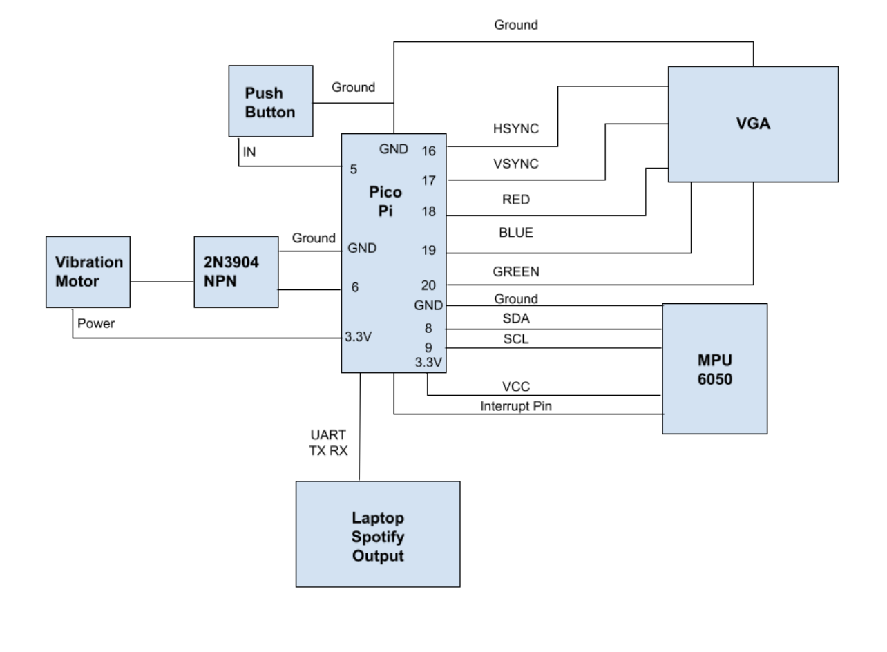
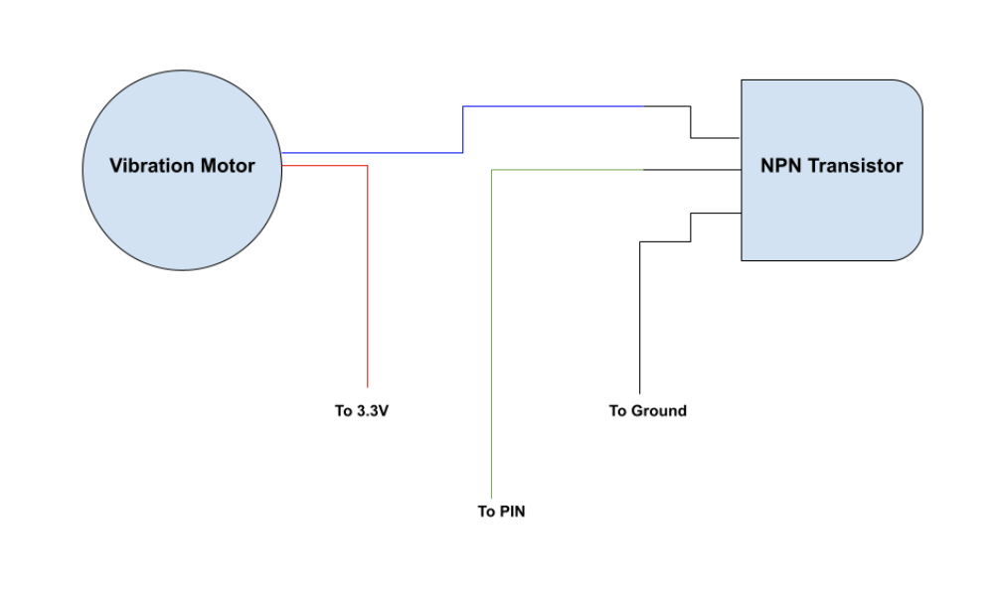
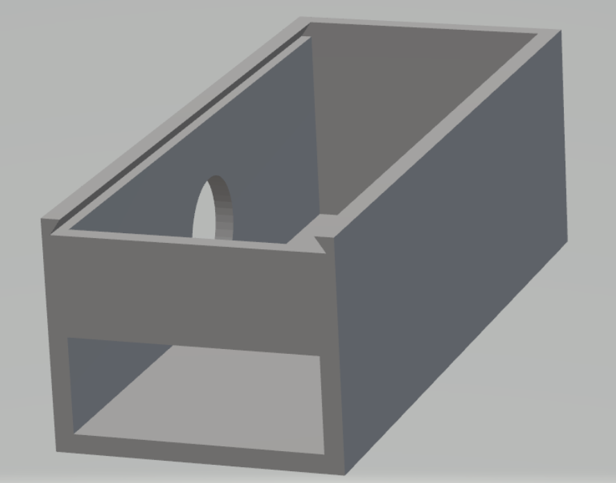
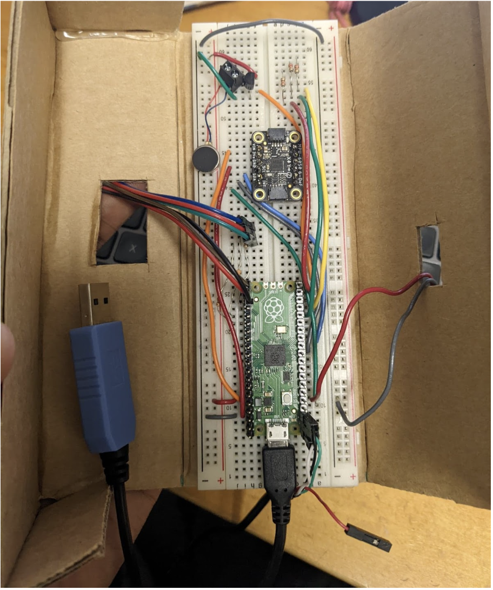
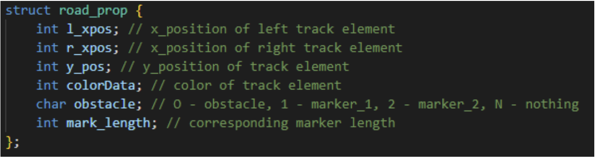
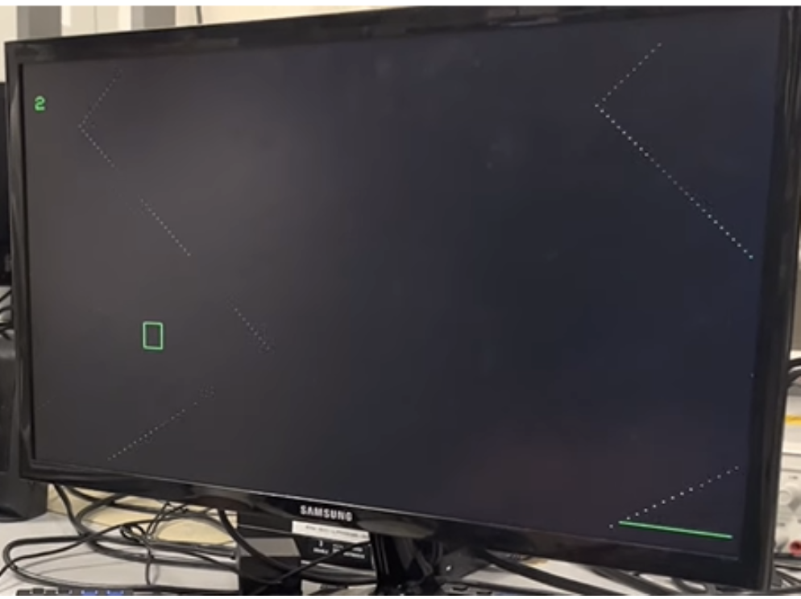
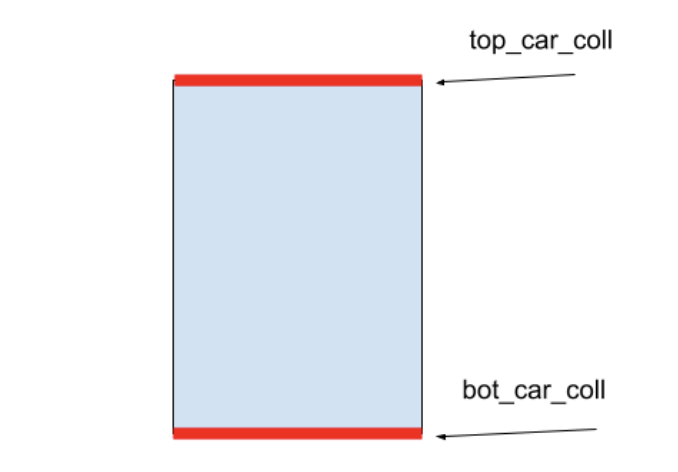
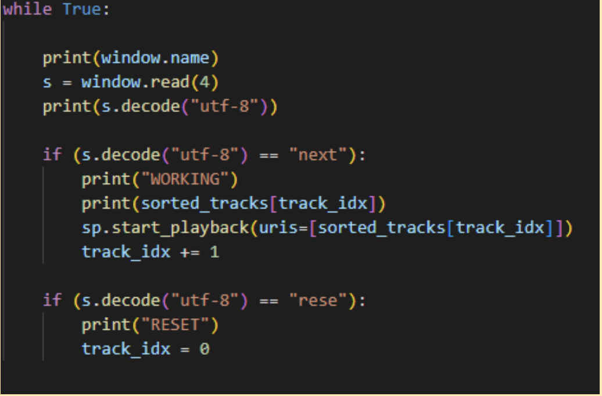
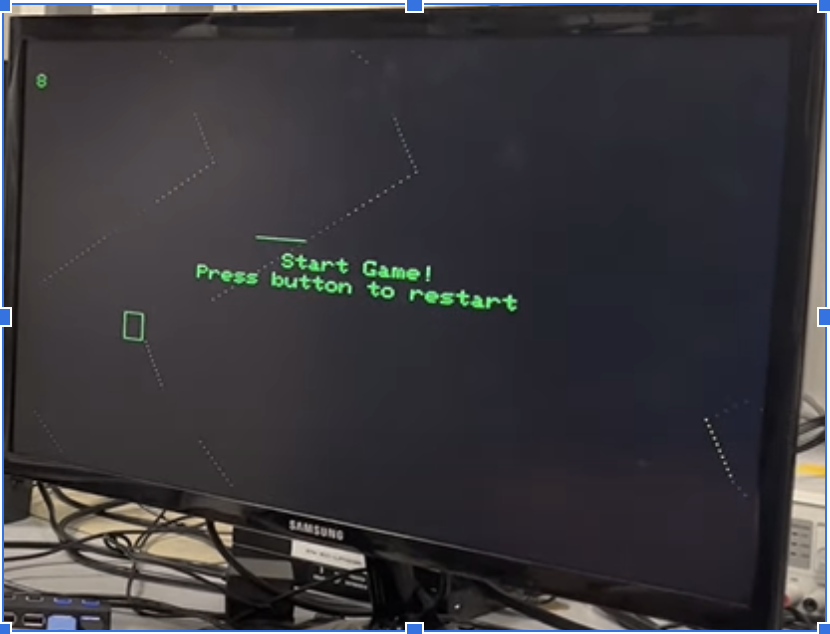
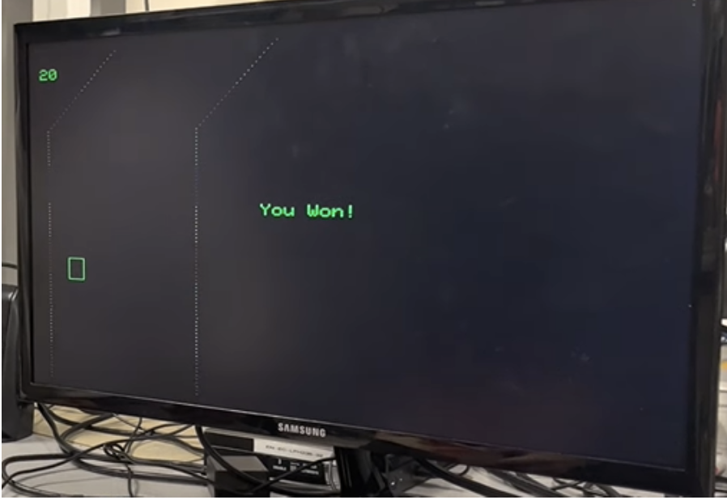

# Mario-Kart Inspired Racing Game Final Project

## Project Introduction

Our final project is an arcade style racing game that is controlled using a handheld controller, inspired from mario-kart style games we played growing up. 

The car and the randomly curving track are displayed on a VGA screen which is connected to the controller. Both the car and track are able to horizontally wrap across the screen. As the game progresses, the track scrolls down on the screen and the player must use the controller to steer the car away from the edges of the track. Hitting the edge will result in a game over. There are also randomly generated (green “line”) markers along the track that the player needs to hit to increase their score. However, hitting a marker will also cause the game to speed up, adding more difficulty as the score increases; additionally, whenever a marker is hit, a Spotify song with increasing tempo begins playing and a vibration sensor provides tactile feedback. We decided to make this our final project because we wanted a project that was engaging, fun, and easy to play. The technical details of the project also draw heavily from what we have learned from the previous labs.

## High Level Design

The inspiration for our project came from the game Mario Kart Wii. The core structure of a Mario Kart game consists of a player vehicle, the track, a lap counter, and a motion controller. We took these core ideas and did our best to implement them using the PICO and VGA screen. 

The logic of our game follows a straightforward set of directions. Once the game begins, if the car ever intersects with a track boundary, the game ends. Also, if it ever encounters a marker, increase the scrolling speed and increment the score counter. This continues until the player causes a game over or if the player reaches a score of 20. After a game over, the player has the option of resetting by hitting the reset button, score is reset and a new map is generated. 

The only copyrights that are relevant to our project concern the use of Spotify and using the app to play music. We registered the app through the online platform for app developers, so sharing videos of the app and the songs playing is acceptable. 

#### Hardware/Software Trade-Offs

From a general perspective, the choice was made early on to make the project more logic and software dependent rather than hardware dependent. This involved only utilizing the minimal amount of hardware necessary to aid the movement of the car and collisions with the marker and road. As such, the only hardware components utilized were the VGA screen, IMU, and a vibration motor. 
 
Since our initial plan included a sound and music component, the spotify route as opposed to the sound synthesis was chosen. The spotify route allowed including a larger dataset of songs and significantly reduced computational overhead. However, spotify did limit the ability to customize the music at each marker collision. We played a cool synthwave playlist that fit the vibes of our game. Ultimately, the ease of implementation, reduced computation, and reduced hardware (DAC is not necessary) made spotify the better option over the digital synthesis route.
 
Lastly, for the marker collision, a decision was made to only count the collision if the car’s top line with any point of the marker. This significantly lowered the collision logic for markers within the main thread, but this also made hitting markers somewhat challenging. Ultimately, this simply became embedded into our game’s natural difficulty.

## Hardware Design

The hardware for our controller is straightforward and concise. All circuitry is done on a single breadboard and the wiring is neatly organized to avoid complications. Below we have detailed every component of the hardware as well as many diagrams and pictures of the circuitry.

1) PICO - Microcontroller in charge of running the game code, writing to the VGA screen, and taking input from the MPU-6050

2) VGA - Graphics screen that follows HSYNC and VSYNC protocol to display the track, car, and score.

3) Breadboard - 16.6 cm by 5.6 cm breadboard that holds all the hardware circuitry.

4) MPU_6050 - Gyroscope sensor attached to controller in order to measure acceleration and tilt angle. Data is used to move the vehicle on screen accordingly.

5) Vibration Motor - Used to send vibration feedback whenever the player hits a marker. Controlled using PWM. 

6) 2N3904 NPN - The transistor used in the vibration motor circuitry. Allows for better control of the motor.

7) Push Button - A simple button used to start a new game or restart after a game over. It is attached to the outside of the controller.

8) Cardboard Container - A cardboard rectangular prism, approximately 18 cm by 6 cm by 5 cm. All circuitry is encapsulated by the prism. There are holes on the side to allow wires from the VGA and laptop. Can be opened and closed to allow adjustments to the breadboard.

*Figure 1: Overall Hardware Setup*

*Figure 2: Vibration Motor Circuitry*

*Figure 3: 3D Model of container*

*Figure 4: Image of Circuit*

### Hardware Container

In order to provide a better user experience for the player and ensure the players safety, we wanted to put all the circuitry and breadboard wiring into a rectangular box. The player would then hold the box in one hand and use it as a remote. The original plan was to place the breadboard in a 3D printed container, but we ran out of time to print it for the demo. Instead, we used some cardboard to create a similar version of the 3D printer. This cardboard container can be opened up and closed, and has holes for all the wiring. The controller used in the demo was the cardboard container controller.

## Software Design

There are three main parts to the software: main game thread, spotify thread, main

Main Game Thread: The main game thread handles the key aspects of the game including path wrapping, car-wrapping, ring-buffer updates, road and marker collision detection, core updates, and frame updates. Additionally, at each marker hit, the main thread also signals a shared spotify variable to indicate a new track switch.

Serial Spotify Thread: This thread runs on core 1 and concurrently reads the shared spotify_signal variable to recognize if a “next” (indicating switch to the next song in the queue) must be sent to the spotify script. The thread avoids race conditions by only reading the variable as opposed to also writing to it. When the game is reset, a “rese” is sent, resetting the song queue. 

Main: The main handles initializing the GPIO interrupt for the IMU. This pulsed signal on the gpis pin determines when the data should be read from the IMU’s buffer. Additionally, the main also assigns the game thread to core 0 and the serial/spotify thread to core 1. Lastly, it assigns the PWM functionality to the vibration motor, setting the PWM max threshold to 12. 

### Software Specifics

#### Ring Buffer (vertical wrapping)

Vertical scrolling was pivotal to create the effect of the road moving from the top to the bottom of the screen and the car moving forward. While the trivial strategy of simply redrawing the pixels in the same location iteratively was considered, this strategy would severely limit the road’s ability to hold properties such as curvature, obstacles, power-ups, and colors, several limiting the difficulty and fun of the game. 
 
To cycle the properties of the road down, two strategies were considered: the ring buffer and bubbling. The bubbling straggles would involve looping through the entire array and manually bubbling properties down through the entire array. This is a rather inefficient approach and would limit the amount of game logic calculations that can be be carried out. The ring buffer approach is an efficient approach that utilizes pointers to indices in the array, and rather than manually bubbling data, only the pointers are shifted by 1 per iteration. The road state pointed to by the top pointer is then update with new properties rendering a new road state at the top of the vga screen. The previous states are naturally pushed down as the road is redrawn on the vga from the new top pointer to the new bottom pointer. 
 
The ring buffer, in this way, facilitated expanding the state properties of the road and only required a single index update per frame. The ring buffer strategy integrated rather well with the array design structure chosen initially as only two pointer had to be tracked: pointerEnd and pointerStart. 
 
It was a little difficult to understand how the ring buffer was operating (two pointers chasing each other around a static memory space), but it was worth spending some time to understand it, as the relative performance increase due to using a ring buffer was necessary to implement functional scrolling. 

*Figure 5: Image of struct utilized*

Road_prop is the struct that was used to keep track of all of the data associated with a particular pixel on the track. The reason for having to keep track of all of this positional state information (l_xpos, r_xpos, y_pos) for each ring buffer track element was due to the challenges of wrapping and erasing previously drawn elements. This motivation will be covered in greater detail in the wrapping description section. 
 
An added bonus to the road_prop struct was the colorData, which enabled keeping track of the color of a particular element of the array, so we were able to generate a Mario Kart “Rainbow-Road” like effect by incrementing a counter for subsequent pixels added and changing the color when that count threshold was reached. The boundaries of the track in Figure a exhibits this behavior. 

#### Marker Generation & Deletion

To generate markers, each road was provided a marker state. This character property effectively indicated the directional placement of the marker. 
 
To initially generate the marker, a random value was first selected. To control the probability of the marker generation, it is only generated when when the random value is above 48 in a range of 0 to 50 inclusive. This ultimately results in a generation probability of 4%. To avoid multiple markers to be generated when the existing marker is yet to be hit or hasn’t passed through the car’s current position, a marker_gen boolean is tracked. This allows knowing if the previous marker has been hit and if a new marker has been generated. To updates the road’s properties, the marker length is assigned to a random value between 40 to 90 pixels and the direction is assigned based on marker length. Generally, longer length markers are favored on the left side while shorter length markers are favored on right side. The directional position of the marker is indicated by updating the obstacle character property to ‘1’ to indicate a left directionally positioned marker and ‘2’ for a right directionally positioned marker. Drawing the marker then becomes a rather trivial task as the pixel it is attached to is known and so its length. The drawing logic is, thus, then embedded into the main road-drawing loop.
 
To identify the marker has been hit by the top line of the car, the car’s current top line position is compared to the current pixel’s obstacle position. If the marker is right sided, the absolute difference between the right corner and the pixel’s location is considered. If the difference falls within the range of the marker in that position, the boolean tracking a hit is set high. A similar logic is followed for left sided markers.
 
Once the marker has been hit, the marker is then erased using a simple fillRect, the spotify is signaled, marker_gen is flagged to be false, the pixelData array obstacle character is set to N (indicating no marker), the vibration logic is activated, and the score is incremented.

#### Car Position Control (IMU)

From the data sheet, it was determined that the 0x3B
register must be written to in order to queue the accelerometer data and the 0x43 register must be
written to in order to buffer in gyroscope data. To achieve these writes, the i2c_write_blocking
function with parameters including the address of the device (0x68) and  memory address of the
variable storing the register value. To read in the queued value (6 bytes for the accelerometer - 2
for x, y, z & 6 byes for for gyroscope - 2 for roll, pitch, yaw), the i2c_read_blocking method with
the device address, the address to write to, and the number of bytes is used. Each of the 3 values
of the acceleration and the angular rate is found by OR’ing the 2 byte reads that compose the top
and bottom half.

To translate the complementary angle to the vga screen, the value is simply divided by -3. This value was experimentally chosen as it provided the best control over the movement of the car and had an acceptable reaction time. This allows for the eventual horizontal wrapping of the car and also makes the controls more sensitive, making the game more challenging. The starting position of the car is the middle of the screen, and any shifts away from the zero derive from the rotational translation of the IMU. 

#### Road Curvature

In order to produce the random curves in the track visible in the game, a basic strategy was implemented. The track is broken down into linear segments of a randomly sampled length, sampled from the following range: [10,20,30,40,50,60,70]. The slope of the line (pixel increment in x-direction) is also randomly sampled within the following range: [-6,-4,-2,0,2,4,6]. A counter (init_curve) counts up to the randomly sampled length (curve_len), and increments each pixel that is plotted (+= 1 each frame) by the corresponding randomly sampled slope (inc_val). When init_curve == curve_len, init_curve is reset to 0 and the two random variables are resampled. In this way, the track randomly builds itself as time goes on. These parameters were qualitatively adjusted to make the game playable and fun. 

*Figure 6: Curvature Example*

#### Horizontal Wrapping (Road)

Implementing horizontal wrapping for the road was probably one of the most challenging aspects of this project. The primary issue was that markers, erasing, and how the road itself wraps would have to change as a result of the road wrapping. 

Prior to implementing wrapping, road_prop only contained one x_pos element to keep track of horizontal positional state of just one of the two track boundaries. This was possible, because whenever the road would deviate from going straight forward, both lines would be incremented by the same amount so the other line could just be offset from the other element. However, things started getting complex when one road wrapped around, and roads started to change slope increments. In addition, keeping track of l_xpos and r_xpos separately made collision detection and erasing easier. 

It also became necessary to keep track of y_pos of each pixel in order to perform erasing easily. Because the pointerEnd of the ring buffer is constantly shifting down, it is not possible to determine what the y_pos of each track element (after a frame update) is without keeping track for each element. It was also used in the case of erasing a marker when it is hit. One issue we ran into relating to this was we would be able to determine which location in the ring buffer was a marker (because we were storing the obstacle data in the struct), but we didn’t know where marker itself was located on the VGA screen, since the head and tail pointers of the ring buffer are constantly shifting.

After adding this additional state information, horizontal wrapping for the track itself became a simple series of checks to see if the newly generated track element (pixel) would be within the [0, 640) pixel range. If it is outside of the range, just wrap the new pixel corresponding to whichever track side (l_xpos or r_xpos) over to the other side. 

Erasing of these track pixels each frame was also made significantly easier with the inclusion of y_pos in the struct, as now calling two fillRects on (l_xpos, y_pos) and (r_xpos, y_pos), coloring them black, will be sufficient. 

### Colliders

The most efficient way to implement collision was just to keep track of whether the top or bottom of the car is in collision, as depicted in Figure b. To do this, top_car_coll and bot_car_coll were pointers to locations in the ring buffer relative to the top of the ring buffer (pointerEnd), corresponding to the y-pixel positions of the top and bottom of the car. Each frame these pointers would also be incremented, along with pointerEnd, so they retained the same offset from the top of the VGA screen– since the car always maintains the same y-pos. 

*Figure 7: Car Collision Diagram*

The initial implementation of colliders for the track used basic equality operators to check if the current_x position of the car was within a specified range of the track. This doesn’t work too well with wrapping. The inclusion of l_xpos and r_xpos made checking for collisions easier as well, especially with car wrapping. The better strategy was to compute the absolute difference between the car’s position and the track boundaries, and if the difference was less than 2, report a collision. Essentially this meant comparing l_xpos and r_xpos corresponding to the top_car_coll and bot_car_coll to the current position of the car. 

#### Spotify API

From a system level, the Pico was communicating to a laptop via UART in a 
Setup for the Spotify portion of the system was relatively smooth, in part due to the Spotipy Python library and due to its extensive documentation. 
 
On the Python side, environment variables dealing with authentication with my Spotify account are set. Then, a serial monitor is opened to listened to the Pico’s messages. After that, a Spotipy function is called that queries the Spotify API to return the songs of a playlist (playlist_tracks()) and associated data, from which the tempo is extracted. The returned list of songs is then sorted by tempo. 
 
On the C side, a signal_spotify variable was used as the signal the Spotify API to skip to the next (faster) track in the list. The char was initialized to ‘A’. When a marker is hit, the char is set to ‘N’, and the other thread is constantly checking for if signal_spotify is set to ‘N’. If so, the ‘next’ UART message is sent to the laptop, and signal_spotify is reset immediately after. As was mentioned earlier, there was no problem with race conditions in accessing this data/managing UART, as the C code was only writing to UART and the Python was only reading from UART. 
The ‘rese’ UART message is set when the entire game is reset (after a collision and the reset button is pressed).
 
Upon receiving a ‘next’ message on the Python side, the next song of increasing tempo (from the list) is played. Upon receiving a ‘rese’ message on the Python side, the next song that is played is the first one on the playlist. The Python code implementing this logic is below. 

*Figure 8: Code for Spotify*

#### Reset/ Game End

The below figure shows the message printed out to the player on the VGA (using provided VGA setCursor and writeString) when they hit a track boundary. To reset the game, we keep track of a boolean play_again, that is initially set to False. Our main code game loop runs when this variable is set to True, which is possible whenever the hardware button is pressed when the screen below is visible to the player. This loop variable is reset to False immediately after hitting a track boundary, breaking out of the main game loop.  

*Figure 9: Game Reset Image*

The below figure shows the message printed out to the player when they win the game, which happens when 20 green markers have been hit. 

*Figure 10: Game Won Image*

#### Optimizations

Two major optimizations aided in reduced overhead for our game. The first involved adopting and interrupt-based IMU data-read strategy. Rather than sampling at pwm triggered intervals or performing a blocking data-available read, this strategy only triggered the i2c read and write when the IMU’s interrupt pin goes high. The trigger of the MPU6050’s interrupt pin indicates that new values are available in the data buffer for reading. This approach significantly reduces the number of times the threads are unnecessarily interrupted even when new data is not ready. This was achieved by editing the provided accelerometer read and write files by enabling pulse-based interrupts through register 0x37. 

The second optimization explored dealt with the VGA. As opposed to erasing the entire screen per frame update, only pixels that are currently active are erased. These pixels include the road, the car, the markers, and the score area. This strategy avoids the flickering effect from when the entire screen is erased and frees up several frames for other game-related computations. 

## Design Results

We were able to experiment with the MPU and found a good balance between the accelerometer and gyroscope that allowed for control to be responsive and accurate. 

We made sure our device was safe by putting all the circuitry into a closed box and making sure there were no loose or exposed wires.
The speed of the game was controlled by the spare_time yield within the main game thread. The default frame rate is 30 fps; however, the game gradually gets faster by reducing the spare time yield in between successive thread calls. The max spare time available when measured was approximate 23000 uS and the minimum is 3000 (if the user were to not miss any markers and win the game). Lowering the spare time thus creates the illusion of faster speeds but does eventually introduce flickering. 

A good minimum separation for pixels to be placed on the track was also qualitatively tuned. The determined separation of 5 pixels in the y-direction seemed to look good when the game was being run, even at the higher speeds. Having this separation also allowed the ring buffer to be slightly smaller, which is more efficient in terms of storage (ultimately going with a size of 480 y-axis pixels/5 separation/pixel) = 96. 

## Conclusion

Overall, we are very satisfied with how our project turned out. The game was similar to how we envisioned it to be and meets most of our expectations. It runs smoothly, is easy to pick up and play, and provides interactive feedback. However, there are a few features we were unable to implement such as audio feedback directly from the controller and some extra game details like power ups. Additionally, from a technical perspective, we would have also liked to explore VGA pointers. VGA pointers was an idea suggested by Professor Land that would only involve erasing the top horixontal line of the vga as opposed to erasing every since active pixel. This would have certainly allowed us to achieve greater game speeds, increase the difficulty, and minimize flickering.

From this project there are few things we learned going forward. Firstly, it is important to try and finalize and commit to a design early on. Lacking a clear goal and direction early on led to a lot of wasted time. 

We did not run into any issues with patents and such because all of our hardware parts were gathered from resources in the lab, and almost all of our software was created from scratch. Some parts of the code were borrowed and modified from previous labs. We did use the open-source Spotipy wrapper to make Spotify API requests using Python, however. 

## Appendix A
Project on the course page:
The group approves this report for inclusion on the course website.

Project on the course YouTube channel:
The group approves the video for inclusion on the course youtube channel.

## Appendix B

Datasheets:

MPU6050: [MPU 6050 Datasheet](https://invensense.tdk.com/wp-content/uploads/2015/02/MPU-6000-Datasheet1.pdf)

Contribution:

Kevin Guo: Hardware Design - container design and circuit assembly

Shreshta Obla: Software Design - Car and Road Wrapping, Curvatures, and Spotify

Nikhil Satheesh Pillai: Software Design - Marker Generation, Speed, Optimization, Ring Buffer

## Appendix C

Code: [Final Code](https://github.coecis.cornell.edu/sko35/4760finalcode)

