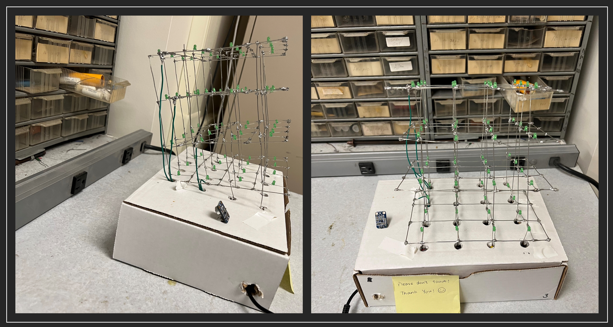
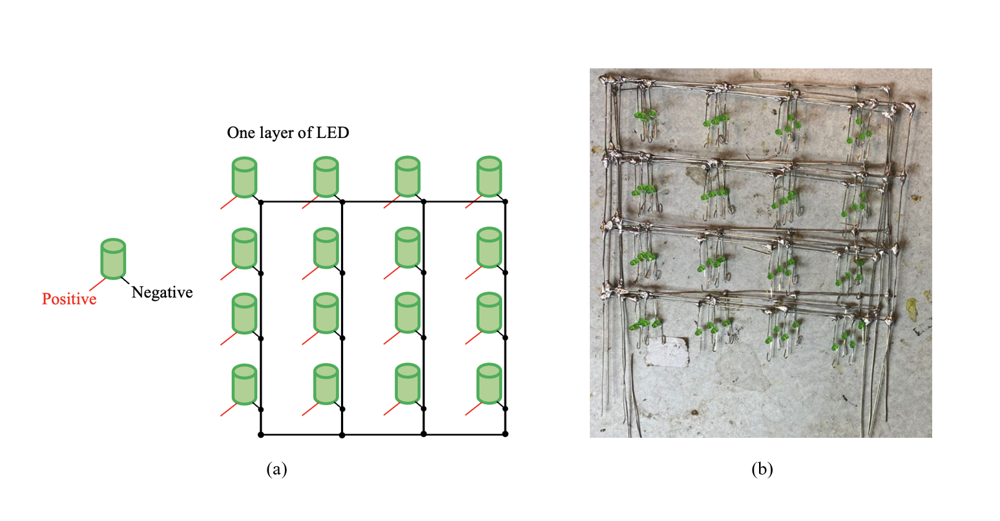
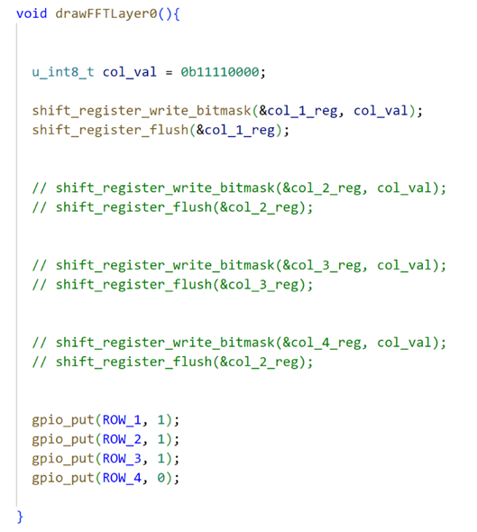
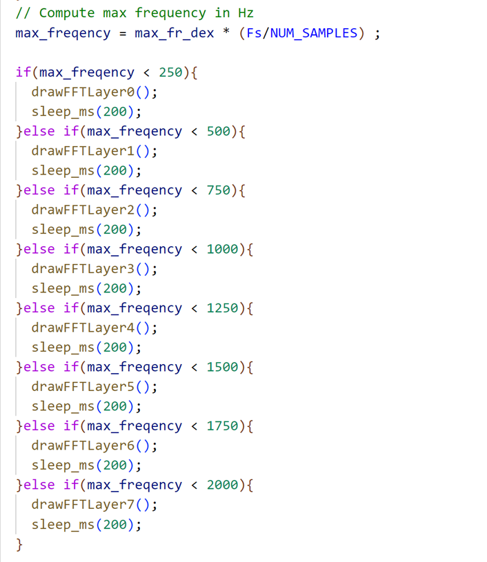
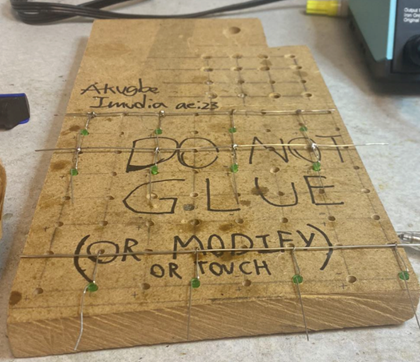

<div id='write'  class=''><div align="center" class="container">
<div class="starter-template">
  <h1>Dancing Cube</h1>
    <h3> The Leaning Cube of Pisa</h3>
  <p class="lead"> Yucheng Peng (yp284) | Yuchen Lu (yl2237)</p>
</div>



# 1.Introduction

We build a 4*4*4 LED cube named *the Leaning Cube of Pisa* that can dance with the beating of the music!

 Electronic music visualization has been used to enhance the music listening experience for deaf and hard-of-hearing people. We want to create a gadget that visualizes music and makes music available to everyone in the globe in order to better assist deaf or hearing-impaired persons. Anyway, it’s really cool to build an LED Cube and make it dance to the rhythm of the music.

# 2. High-Level Design

The materials needed to build an LED cube are very simple and easy to obtain. Just some LEDs and some wires then we can build a LED cube. To set up an LED cube using a Pico projector and a microphone, we need to connect the Raspberrypi Pico to a computer that is capable of running the necessary software to control the LED cube and generate music visualization. The microphone would also need to be connected to the computer or device in order to capture the audio input. 

Once everything is set up, we would need to use software to analyze the audio data from the microphone in real time, using the Fast Fourier Transform (FFT) algorithm to extract the frequency components of the music. This data can then be used to control the LED cube, causing the individual LEDs to light up or blink in a pattern that corresponds to the music.

It may also be necessary to use additional hardware, such as specialized LED drivers, to control the LED cube and ensure that it can respond quickly and accurately to the music visualization data. Overall, creating a music visualization system using an LED cube and a Pico projector would require a combination of hardware and software, as well as some knowledge of audio processing and LED control techniques.

In order to control a 4x4x4 LED cube, we would need to use a shift register with at least 64 output pins (16 pins per layer, with 4 layers in the cube). We would also need to use software or additional hardware, such as microcontrollers, to generate the data signals that will control the LED cube. Additionally, we may need to use specialized LED drivers or other hardware to ensure that the LED cube can be controlled accurately and efficiently.

# 3. Program and Hardware Design

## 3.1 Hardware Design

### 3.1.1 Components

As shown in the following Figure 1, the supplies for our project consist of Pi Pico, a microphone module, ninety-six 3mm green LEDs, four shift registers, twenty 100 Ohm resistors, 3.3 Voltage power, and many jumper cables. All components are connected to assemble the circuit manually, especially the LED cube. Therefore, the following parts will illustrate the circuit design, mechanism, and LED cube assembling process. 

<center>
    
    <br>
    <div style="color:orange; border-bottom: 1px solid #d9d9d9;
    display: inline-block;
    color: #000000;
    padding: 2px;">Fig.1. Components List</div>
</center>

### 3.1.2 Circuit Design

The circuit of the dancing LED cube is designed as shown in the Figure 2. There are four shift registers used to control the four columns of the LED cube. Rows of LED cubes are controlled by four GPIO pins (GPIO 22, GPIO 21, GPIO 2, and GPIO 3). Four shift registers are connected to the microcontroller by 6 GPIO pins. All shift registers are connected to the 3.3 voltage output pin and ground pin on Pi Pico. GPIO 10 is used to input the storage-register clock (RCLK) signal to four shift registers. GPIO 11 is used to input the shift-register clock (SRCLK) to four shift registers. GPIO 9, GPIO 12, GPIO 13, and GPIO 14 are used to input serial signals to four shift registers respectively, and more controlling details will be indicated in the program design section.

For the microphone module, Vcc and GND pins are respectively connected to Pico’s 3.3 Voltage out pin and ground pin, and the output signal pin is connected to GPIO 26 to input the receiving signal to the microcontroller. After computing the corresponding frequency of receive voice, the LEDs will blink in a specific pattern (different layers, columns, and rows) for different frequencies, this mechanism will be explained in the software design part.

<center>
    
    <br>
    <div style="color:orange; border-bottom: 1px solid #d9d9d9;
    display: inline-block;
    color: #000000;
    padding: 2px;">Fig.2. Mechanism of the circuit. <br> This figure includes possible important circuits of components. (Not all the GPIO and other exports have been shown in this figure, just conceptualized circuit figure). </div>
</center>
As shown in Figure 3(a), the negative pins of one-layer LEDs are all connected, then one jumper wire is used to connect this layer’s negative wire to the GPIO pin (four layers of negative electrodes are connected to GPIO 22, GPIO 21, GPIO 2 and GPIO 3 respectively), which means the rows of LED cube can be controlled by four GPIO pins.  Figure 3(b) shows the real layers built into the project. 

<center>
    
    <br>
    <div style="color:orange; border-bottom: 1px solid #d9d9d9;
    display: inline-block;
    color: #000000;
    padding: 2px;">Figure.3(a). Four-layer connection circuit of LEDs. 3(b). Real four-layer LED cube in process. </div>
</center>
As shown in Figure 4(a) and (b), after four layers of LEDs are made successfully, positive electrodes of each column from layer one to layer four will be connected separately. Combined with the circuit shown in Figure 4, column LEDs can be controlled by shift registers respectively. By inputting different CLK signals from the microcontroller from GPIO pins, LEDs in different columns can blink in different patterns. More details in blink patterns will be explained in the software design part.

<center>
    
    <br>
    <div style="color:orange; border-bottom: 1px solid #d9d9d9;
    display: inline-block;
    color: #000000;
    padding: 2px;">Figure.4(a). Four-layer connection circuit of LEDs. 4(b). Real four-layer LED cube in process. </div>
</center>

## 3.2 Software Design 

### 3.2.1 Shift Register

The 74HC595 is a popular shift register integrated circuit (IC) that is commonly used to expand the output pins on a microcontroller. It allows a microcontroller to control a large number of outputs by using only a few digital pins. This makes it ideal for applications where there are many LEDs or other output devices that need to be controlled independently. It can be used in a wide range of projects, from simple LED displays to complex robotics projects.

As shown in Figure 5, we initialize all 4 shift registers to create a col_1_reg, col_2_reg, col_3_reg, and col_4_reg. 


<center>
    
    <br>
    <div style="color:orange; border-bottom: 1px solid #d9d9d9;
    display: inline-block;
    color: #000000;
    padding: 2px;">Figure.5. Shift register init code</div>
</center>


We connect each layer directly to the Pico’s pin and set the pin as the output model as shown in Figure 6.


<center>
    
    <br>
    <div style="color:orange; border-bottom: 1px solid #d9d9d9;
    display: inline-block;
    color: #000000;
    padding: 2px;">Figure.6. 4 Layers init code</div>
</center>


Then we define 8 different models for music virtualization. The image below shows how the different models are illuminated, with eight different modes corresponding to a-h.

<center>
    
    <br>
    <div style="color:orange; border-bottom: 1px solid #d9d9d9;
    display: inline-block;
    color: #000000;
    padding: 2px;">Figure.7. 8 different models</div>
</center>


As shown in Figure 8, the first value col_val = 0b11110000 represents the input serial value of the shift register. We input 0b11110000 to set the shift register output QB, QC, QD, QE, and QF to high voltage. And then we flush the value to the first register col_1_reg. On other hand, deciding which layer is lit is done by pulling that layer to digital low. For instance, we use gpio_put(ROW_4, 0) to make sure only the bottom layer will be connected to the ground. The effect of this function is exactly what is shown in Figure 7(a). 

<center>
    
    <br>
    <div style="color:orange; border-bottom: 1px solid #d9d9d9;
    display: inline-block;
    color: #000000;
    padding: 2px;">Figure.8. draw model code</div>
</center>


### 3.2.2 FFT Algorithm

As mentioned earlier in lab 1, the FFT (Fast Fourier Transform) is an algorithm that can be used to compute the discrete Fourier transform of a sequence of complex numbers. This means that if we have a sound signal that we want to analyze in the frequency domain, we can first convert it into a sequence of complex numbers and then apply the FFT algorithm to compute the DFT. This will give us a transformed sequence of complex numbers that represents the frequencies present in the original sound signal.

To use the FFT for analyzing a sound signal, we will need to first digitize the signal by sampling it at regular intervals and quantizing the samples to represent them as a sequence of numbers. This will give us a sequence of complex numbers that you can input into the FFT algorithm. Then, we can apply the FFT to compute the DFT of the sequence and obtain the transformed sequence of complex numbers. This transformed sequence will contain information about the frequencies present in the original sound signal, which we can then analyze to learn more about the characteristics of the signal.

As shown in Figure 9, after we get the max_freqency, we divide the sound frequencies into 8 ranges, from 0 to 2000, with different ranges corresponding to different drawFFTLayer() functions. The achieved effect is the a-h in Figure XXX

<center>
    
    <br>
    <div style="color:orange; border-bottom: 1px solid #d9d9d9;
    display: inline-block;
    color: #000000;
    padding: 2px;">Figure.9. Frequency reaction code</div>
</center>


## 3.3 Some Difficulties 

The first difficulty in hardware design is how to connect the LEDs layer by layer. It’s very difficult to connect them vertically and trimly without any tools. Thanks to the grid board provided by Prof. Hunter (Figure 10), the initial grid could be built smoothly. Another difficulty in this part is how to make sure each layer’s LEDs are correctly aligned. This requires us to check each LED in the right position (right connection for both negative and positive anodes) row by row and layer by layer. If one of the LEDs is connected in the wrong direction, the LED cube cannot work correctly. Besides, the biggest difficulty in this part is how to solder each LED firmly, this requires high patience and great welding skills. 

<center>
    
    <br>
    <div style="color:orange; border-bottom: 1px solid #d9d9d9;
    display: inline-block;
    color: #000000;
    padding: 2px;">Figure.10. Grid board for welding LED layers.</div>
</center>


Another tricky point is about the software that uses shift registers. We need to input the bit number like 0b1111000 and we need to set up a connection between the real LED cube and the bit number. We also have 4 different registers and 4 layers. We abstract the bit number and the different shift registers and different layers to a function called drawOnePoint(x,y,z). Through this function, we only need to input the 3D coordinates of the LED cube and it could help us to light up the corresponding LED.

# 4. Results

## 4.1 Demo Video

  <div class="center-block">
<iframe width="640" height="360" src="https://www.youtube-nocookie.com/embed/RqW3QQx8CpY" title="YouTube video player" frameborder="0" allow="accelerometer; autoplay; clipboard-write; encrypted-media; gyroscope; picture-in-picture" allowfullscreen></iframe>
      <h4 style="text-align:center;">Demonstration Video</h4>
  </div>


Therefore, this project has great usability for us or other people. Based on the circuit and codes shown in the report, it is feasible to build larger dancing LED cubes and even more dancing and flowing pattern of LEDs.

## 4.2 Testing

We need to test whether each Led can light up. So the following program is used to blink the specific LED

```C
//=================================================================
// Draw one point of the LED cube
//=================================================================
void drawOnePointRow(int z){
  if(z == 0){
    gpio_put(ROW_1, 0);
    gpio_put(ROW_2, 1);
    gpio_put(ROW_3, 1);
    gpio_put(ROW_4, 1);
  }else if(z == 1){
    gpio_put(ROW_1, 1);
    gpio_put(ROW_2, 0);
    gpio_put(ROW_3, 1);
    gpio_put(ROW_4, 1);
  }else if(z == 2){
    gpio_put(ROW_1, 1);
    gpio_put(ROW_2, 1);
    gpio_put(ROW_3, 0);
    gpio_put(ROW_4, 1);
  }else if(z == 3){
    gpio_put(ROW_1, 1);
    gpio_put(ROW_2, 1);
    gpio_put(ROW_3, 1);
    gpio_put(ROW_4, 0);
  }
}

void drawOnePoint(int x, int y, int z){
    if(x > 4 || x < 0 || y > 4 || y < 0){
      return;
    }


    u_int8_t col_val = 0b10000000;

    // x == 0, col_val = 0b1000000;
    // x == 1, col_val = 0b0100000;
    // x == 2, col_val = 0b0010000;
    if(x == 0){
      col_val = 0b10000000;
    }else if(x == 1){
      col_val = 0b01000000;
    }else if(x == 2){
      col_val = 0b00100000;
    }else if(x == 3){
      col_val = 0b00010000;
    }

    if(y == 0){
      drawOnePointRow(z);
      shift_register_write_bitmask(&col_1_reg, col_val);
      shift_register_flush(&col_1_reg);
    }else if(y == 1){
      drawOnePointRow(z);
      shift_register_write_bitmask(&col_2_reg, col_val);
      shift_register_flush(&col_2_reg);
    }else if(y == 2){
      drawOnePointRow(z);
      shift_register_write_bitmask(&col_3_reg, col_val);
      shift_register_flush(&col_3_reg);
    }else if(y == 3){
      drawOnePointRow(z);
      shift_register_write_bitmask(&col_4_reg, col_val);
      shift_register_flush(&col_4_reg);
    }
}
```

And we also set up a power-on animation that automatically lights up all the LEDs in a row, as shown in Figure 11 and Figure 12, once every time we power up the Pico. This ensures that all LEDs are properly connected and that there are no disconnections. 

<center>
    
    <br>
    <div style="color:orange; border-bottom: 1px solid #d9d9d9;
    display: inline-block;
    color: #000000;
    padding: 2px;">Figure.11. Power-on animation.</div>
</center>

<center>
    
    <br>
    <div style="color:orange; border-bottom: 1px solid #d9d9d9;
    display: inline-block;
    color: #000000;
    padding: 2px;">Figure.12. Power-on animation code.</div>
</center>


## 4.3 Safety Design 

Before we build the LED cube, we estimate and calculate the current required by the LEDs and the supply voltage of the Pico, we ensure that in the worst-case scenario (all LEDs are lit) the total current in the circuit does not exceed the safe current for the human body. In addition, we connected a resistor to the output of each shift register, to ensure that if there is a short-circuit LED will not burn out the entire circuit.

# 5. Conclusions

In this project, we successfully created a dancing LED cube, which is named “the Leaning Cube of Pisa”. There are eight patterns of “dancing” responding to different frequency intervals, and each pattern works successfully. Besides, the light intensity of each LED is strong and none of the LEDs built in the cube are damaged. Though there is some noise in the environment, which means sometimes the LED cannot blink as music frequencies. As shown in the video, the dancing LED cube has a high sensitivity to the change of frequency and responds to the frequency changes accurately and rapidly. 

The next time, we might change different blinking patterns for more fancy displays. Besides, we might increase the number of LEDs, increasing them from 96 to 512. And we might increase another blinking pattern as the game of “Gluttonous Snake”.  This will involve defining the game rules, such as how the snake moves, how it grows when it eats food, and what happens when it collides with a wall or itself. Then we can test the program on the LED cube to make sure that it works as intended and make any necessary adjustments or changes.

The circuit and idea of the cube are designed by us. Part of the FFT codes for frequency computation are reused from Lab 1. Apart from the FFT codes, we create our own programs for the dancing LED cube. There is no non-disclosure or trademark issue in this project. If we want to make this project patentable, we still need to create more fancy functions or shapes for the LED cube design. 

# Appendix A


# Group Member

<div class="row" style="text-align:center;">
      <div style="text-align:center;">
          
          <h4>Yucheng Peng | Leading cube of pisa | Yuchen Lu</h4>
      </div>
      <div class="col-md-6" style="font-size:16px">
          
          <h3>Yucheng Peng</h3>
          <p class="lead">yp284@cornell.edu</p></div>
          
          <h3>Yuchen Lu</h3>
          <p class="lead">yl2237@cornell.edu</p></div>

# Code Appendix

We put all our CODEs in the github! See the linke below

https://github.com/Typo90/ECE-5730

The main program led_cube.c is attached below

## led_cube.c

```C
/* 
* ---------------------------------------
* Copyright (c) Sebastian Günther 2021  |
*                                       |    
* devcon@admantium.com                  |    
*                                       | 
* SPDX-License-Identifier: BSD-3-Clause | 
* ---------------------------------------
*/
#include <stdio.h>
#include <stdbool.h>
#include <stdlib.h>
#include <string.h>
#include <pico/stdlib.h>
#include "rp2040_shift_register.h"


/*
Pinouts:
    ___   ___
QB  |  |_|  |   VCC
QC  |   7   |   QA
QD  |   5   |   SER
QE  |   H   |   OE
QF  |   C   |   RCLK
QG  |   9   |   SRCLK
QH  |   5   |   SRCLR
GND |   A   |   QH'
    ---------


74HC595     pico
-------     ----
VCC         3.3V
SER         GPIO 12
OE          GND
RCLK        GPIO 10
SRCLK       GPIO 11
SRCLR       3.3V
*/


// Define pins for the LED cube's rows
#define ROW_1 22
#define ROW_2 21
#define ROW_3 2
#define ROW_4 3

// Define ShiftRegisters
ShiftRegister row_reg;
ShiftRegister col_1_reg;
ShiftRegister col_2_reg;
ShiftRegister col_3_reg;
ShiftRegister col_4_reg;

/**
 * Hunter Adams (vha3@cornell.edu)
 * 
 * This demonstration calculates an FFT of audio input, and
 * then displays that FFT on a 640x480 VGA display.
 * 
 * Core 0 computes and displays the FFT. Core 1 blinks the LED.
 *
 * HARDWARE CONNECTIONS
 *  - GPIO 16 ---> VGA Hsync
 *  - GPIO 17 ---> VGA Vsync
 *  - GPIO 18 ---> 330 ohm resistor ---> VGA Red
 *  - GPIO 19 ---> 330 ohm resistor ---> VGA Green
 *  - GPIO 20 ---> 330 ohm resistor ---> VGA Blue
 *  - RP2040 GND ---> VGA GND
 *  - GPIO 26 ---> Audio input [0-3.3V]
 *
 * RESOURCES USED
 *  - PIO state machines 0, 1, and 2 on PIO instance 0
 *  - DMA channels 0, 1, 2, and 3
 *  - ADC channel 0
 *  - 153.6 kBytes of RAM (for pixel color data)
 *
 */

 // Include VGA graphics library
#include "vga_graphics.h"
// Include standard libraries
#include <stdio.h>
#include <stdlib.h>
#include <string.h>
#include <math.h>
// Include Pico libraries
#include "pico/stdlib.h"
#include "pico/multicore.h"
// Include hardware libraries
#include "hardware/pio.h"
#include "hardware/dma.h"
#include "hardware/adc.h"
#include "hardware/irq.h"
// Include protothreads
#include "pt_cornell_rp2040_v1.h"

// Define the LED pin
#define LED     25

// === the fixed point macros (16.15) ========================================
typedef signed int fix15 ;
#define multfix15(a,b) ((fix15)((((signed long long)(a))*((signed long long)(b)))>>15))
#define float2fix15(a) ((fix15)((a)*32768.0)) // 2^15
#define fix2float15(a) ((float)(a)/32768.0)
#define absfix15(a) abs(a) 
#define int2fix15(a) ((fix15)(a << 15))
#define fix2int15(a) ((int)(a >> 15))
#define char2fix15(a) (fix15)(((fix15)(a)) << 15)

/////////////////////////// ADC configuration ////////////////////////////////
// ADC Channel and pin
#define ADC_CHAN 0
#define ADC_PIN 26
// Number of samples per FFT
#define NUM_SAMPLES 1024
// Number of samples per FFT, minus 1
#define NUM_SAMPLES_M_1 1023
// Length of short (16 bits) minus log2 number of samples (10)
#define SHIFT_AMOUNT 6
// Log2 number of samples
#define LOG2_NUM_SAMPLES 10
// Sample rate (Hz)
#define Fs 10000.0
// ADC clock rate (unmutable!)
#define ADCCLK 48000000.0

// DMA channels for sampling ADC (VGA driver uses 0 and 1)
int sample_chan = 2 ;
int control_chan = 3 ;

// Max and min macros
#define max(a,b) ((a>b)?a:b)
#define min(a,b) ((a<b)?a:b)

// 0.4 in fixed point (used for alpha max plus beta min)
fix15 zero_point_4 = float2fix15(0.4) ;

// Here's where we'll have the DMA channel put ADC samples
uint8_t sample_array[NUM_SAMPLES] ;
// And here's where we'll copy those samples for FFT calculation
fix15 fr[NUM_SAMPLES] ;
fix15 fi[NUM_SAMPLES] ;

// Sine table for the FFT calculation
fix15 Sinewave[NUM_SAMPLES]; 
// Hann window table for FFT calculation
fix15 window[NUM_SAMPLES]; 

// Pointer to address of start of sample buffer
uint8_t * sample_address_pointer = &sample_array[0] ;

// Peforms an in-place FFT. For more information about how this
// algorithm works, please see https://vanhunteradams.com/FFT/FFT.html
void FFTfix(fix15 fr[], fix15 fi[]) {
    
    unsigned short m;   // one of the indices being swapped
    unsigned short mr ; // the other index being swapped (r for reversed)
    fix15 tr, ti ; // for temporary storage while swapping, and during iteration
    
    int i, j ; // indices being combined in Danielson-Lanczos part of the algorithm
    int L ;    // length of the FFT's being combined
    int k ;    // used for looking up trig values from sine table
    
    int istep ; // length of the FFT which results from combining two FFT's
    
    fix15 wr, wi ; // trigonometric values from lookup table
    fix15 qr, qi ; // temporary variables used during DL part of the algorithm
    
    //////////////////////////////////////////////////////////////////////////
    ////////////////////////// BIT REVERSAL //////////////////////////////////
    //////////////////////////////////////////////////////////////////////////
    // Bit reversal code below based on that found here: 
    // https://graphics.stanford.edu/~seander/bithacks.html#BitReverseObvious
    for (m=1; m<NUM_SAMPLES_M_1; m++) {
        // swap odd and even bits
        mr = ((m >> 1) & 0x5555) | ((m & 0x5555) << 1);
        // swap consecutive pairs
        mr = ((mr >> 2) & 0x3333) | ((mr & 0x3333) << 2);
        // swap nibbles ... 
        mr = ((mr >> 4) & 0x0F0F) | ((mr & 0x0F0F) << 4);
        // swap bytes
        mr = ((mr >> 8) & 0x00FF) | ((mr & 0x00FF) << 8);
        // shift down mr
        mr >>= SHIFT_AMOUNT ;
        // don't swap that which has already been swapped
        if (mr<=m) continue ;
        // swap the bit-reveresed indices
        tr = fr[m] ;
        fr[m] = fr[mr] ;
        fr[mr] = tr ;
        ti = fi[m] ;
        fi[m] = fi[mr] ;
        fi[mr] = ti ;
    }
    //////////////////////////////////////////////////////////////////////////
    ////////////////////////// Danielson-Lanczos //////////////////////////////
    //////////////////////////////////////////////////////////////////////////
    // Adapted from code by:
    // Tom Roberts 11/8/89 and Malcolm Slaney 12/15/94 malcolm@interval.com
    // Length of the FFT's being combined (starts at 1)
    L = 1 ;
    // Log2 of number of samples, minus 1
    k = LOG2_NUM_SAMPLES - 1 ;
    // While the length of the FFT's being combined is less than the number 
    // of gathered samples . . .
    while (L < NUM_SAMPLES) {
        // Determine the length of the FFT which will result from combining two FFT's
        istep = L<<1 ;
        // For each element in the FFT's that are being combined . . .
        for (m=0; m<L; ++m) { 
            // Lookup the trig values for that element
            j = m << k ;                         // index of the sine table
            wr =  Sinewave[j + NUM_SAMPLES/4] ; // cos(2pi m/N)
            wi = -Sinewave[j] ;                 // sin(2pi m/N)
            wr >>= 1 ;                          // divide by two
            wi >>= 1 ;                          // divide by two
            // i gets the index of one of the FFT elements being combined
            for (i=m; i<NUM_SAMPLES; i+=istep) {
                // j gets the index of the FFT element being combined with i
                j = i + L ;
                // compute the trig terms (bottom half of the above matrix)
                tr = multfix15(wr, fr[j]) - multfix15(wi, fi[j]) ;
                ti = multfix15(wr, fi[j]) + multfix15(wi, fr[j]) ;
                // divide ith index elements by two (top half of above matrix)
                qr = fr[i]>>1 ;
                qi = fi[i]>>1 ;
                // compute the new values at each index
                fr[j] = qr - tr ;
                fi[j] = qi - ti ;
                fr[i] = qr + tr ;
                fi[i] = qi + ti ;
            }    
        }
        --k ;
        L = istep ;
    }
}


//=================================================================
// Draw one point of the LED cube
//=================================================================
void drawOnePointRow(int z){
  if(z == 0){
    gpio_put(ROW_1, 0);
    gpio_put(ROW_2, 1);
    gpio_put(ROW_3, 1);
    gpio_put(ROW_4, 1);
  }else if(z == 1){
    gpio_put(ROW_1, 1);
    gpio_put(ROW_2, 0);
    gpio_put(ROW_3, 1);
    gpio_put(ROW_4, 1);
  }else if(z == 2){
    gpio_put(ROW_1, 1);
    gpio_put(ROW_2, 1);
    gpio_put(ROW_3, 0);
    gpio_put(ROW_4, 1);
  }else if(z == 3){
    gpio_put(ROW_1, 1);
    gpio_put(ROW_2, 1);
    gpio_put(ROW_3, 1);
    gpio_put(ROW_4, 0);
  }
}

void drawOnePoint(int x, int y, int z){
    if(x > 4 || x < 0 || y > 4 || y < 0){
      return;
    }


    u_int8_t col_val = 0b10000000;

    // x == 0, col_val = 0b1000000;
    // x == 1, col_val = 0b0100000;
    // x == 2, col_val = 0b0010000;
    if(x == 0){
      col_val = 0b10000000;
    }else if(x == 1){
      col_val = 0b01000000;
    }else if(x == 2){
      col_val = 0b00100000;
    }else if(x == 3){
      col_val = 0b00010000;
    }

    if(y == 0){
      drawOnePointRow(z);
      shift_register_write_bitmask(&col_1_reg, col_val);
      shift_register_flush(&col_1_reg);
    }else if(y == 1){
      drawOnePointRow(z);
      shift_register_write_bitmask(&col_2_reg, col_val);
      shift_register_flush(&col_2_reg);
    }else if(y == 2){
      drawOnePointRow(z);
      shift_register_write_bitmask(&col_3_reg, col_val);
      shift_register_flush(&col_3_reg);
    }else if(y == 3){
      drawOnePointRow(z);
      shift_register_write_bitmask(&col_4_reg, col_val);
      shift_register_flush(&col_4_reg);
    }

}

void drawFFTLayer0(){


  u_int8_t col_val = 0b11110000;

  shift_register_write_bitmask(&col_1_reg, col_val);
  shift_register_flush(&col_1_reg);


  // shift_register_write_bitmask(&col_2_reg, col_val);
  // shift_register_flush(&col_2_reg);


  // shift_register_write_bitmask(&col_3_reg, col_val);
  // shift_register_flush(&col_3_reg);


  // shift_register_write_bitmask(&col_4_reg, col_val);
  // shift_register_flush(&col_2_reg);


  gpio_put(ROW_1, 1);
  gpio_put(ROW_2, 1);
  gpio_put(ROW_3, 1);
  gpio_put(ROW_4, 0);
    
}

void drawFFTLayer1(){


  u_int8_t col_val = 0b11110000;

  // shift_register_write_bitmask(&col_1_reg, col_val);
  // shift_register_flush(&col_1_reg);

  shift_register_write_bitmask(&col_2_reg, col_val);
  shift_register_flush(&col_2_reg);

  // shift_register_write_bitmask(&col_3_reg, col_val);
  // shift_register_flush(&col_3_reg);

  // shift_register_write_bitmask(&col_4_reg, col_val);
  // shift_register_flush(&col_4_reg);


  gpio_put(ROW_1, 1);
  gpio_put(ROW_2, 1);
  gpio_put(ROW_3, 0);
  gpio_put(ROW_4, 0);
}

void drawFFTLayer2(){


  u_int8_t col_val = 0b11110000;

  // shift_register_write_bitmask(&col_1_reg, col_val);
  // shift_register_flush(&col_1_reg);

  shift_register_write_bitmask(&col_2_reg, col_val);
  shift_register_flush(&col_2_reg);

  //shift_register_write_bitmask(&col_3_reg, col_val);
  //shift_register_flush(&col_3_reg);

  // shift_register_write_bitmask(&col_4_reg, col_val);
  // shift_register_flush(&col_4_reg);

  gpio_put(ROW_1, 1);
  gpio_put(ROW_2, 0);
  gpio_put(ROW_3, 0);
  gpio_put(ROW_4, 0);
}

void drawFFTLayer3(){

  gpio_put(ROW_1, 0);
  gpio_put(ROW_2, 0);
  gpio_put(ROW_3, 0);
  gpio_put(ROW_4, 0);

  u_int8_t col_val = 0b11110000;
  

  // shift_register_write_bitmask(&col_1_reg, col_val);
  // shift_register_flush(&col_1_reg);

  shift_register_write_bitmask(&col_2_reg, col_val);
  shift_register_flush(&col_2_reg);

  // shift_register_write_bitmask(&col_3_reg, col_val);
  // shift_register_flush(&col_3_reg);

  // shift_register_write_bitmask(&col_4_reg, col_val);
  // shift_register_flush(&col_4_reg);


}

void drawFFTLayer4(){


  u_int8_t col_val = 0b11110000;
  

  // shift_register_write_bitmask(&col_1_reg, col_val);
  // shift_register_flush(&col_1_reg);

  // shift_register_write_bitmask(&col_2_reg, col_val);
  // shift_register_flush(&col_2_reg);

  shift_register_write_bitmask(&col_3_reg, col_val);
  shift_register_flush(&col_3_reg);

  // shift_register_write_bitmask(&col_4_reg, col_val);
  // shift_register_flush(&col_4_reg);

  gpio_put(ROW_1, 0);
  gpio_put(ROW_2, 0);
  gpio_put(ROW_3, 0);
  gpio_put(ROW_4, 0);
}

void drawFFTLayer5(){


  u_int8_t col_val = 0b11110000;
  

  // shift_register_write_bitmask(&col_1_reg, col_val);
  // shift_register_flush(&col_1_reg);

  // shift_register_write_bitmask(&col_2_reg, col_val);
  // shift_register_flush(&col_2_reg);

  shift_register_write_bitmask(&col_3_reg, col_val);
  shift_register_flush(&col_3_reg);

  // shift_register_write_bitmask(&col_4_reg, col_val);
  // shift_register_flush(&col_4_reg);

  gpio_put(ROW_1, 1);
  gpio_put(ROW_2, 0);
  gpio_put(ROW_3, 0);
  gpio_put(ROW_4, 0);
}

void drawFFTLayer6(){


  u_int8_t col_val = 0b11110000;

  // shift_register_write_bitmask(&col_1_reg, col_val);
  // shift_register_flush(&col_1_reg);

  // shift_register_write_bitmask(&col_2_reg, col_val);
  // shift_register_flush(&col_2_reg);

  shift_register_write_bitmask(&col_3_reg, col_val);
  shift_register_flush(&col_3_reg);

  // shift_register_write_bitmask(&col_4_reg, col_val);
  // shift_register_flush(&col_4_reg);


  gpio_put(ROW_1, 1);
  gpio_put(ROW_2, 1);
  gpio_put(ROW_3, 0);
  gpio_put(ROW_4, 0);
}

void drawFFTLayer7(){


  u_int8_t col_val = 0b11110000;

  // shift_register_write_bitmask(&col_1_reg, col_val);
  // shift_register_flush(&col_1_reg);


  // shift_register_write_bitmask(&col_2_reg, col_val);
  // shift_register_flush(&col_2_reg);


  // shift_register_write_bitmask(&col_3_reg, col_val);
  // shift_register_flush(&col_3_reg);


  shift_register_write_bitmask(&col_4_reg, col_val);
  shift_register_flush(&col_4_reg);


  gpio_put(ROW_1, 1);
  gpio_put(ROW_2, 1);
  gpio_put(ROW_3, 1);
  gpio_put(ROW_4, 0);
    
}


void drawFancy0(){
  u_int8_t col_val = 0b11110000;

  gpio_put(ROW_1, 0);
  gpio_put(ROW_2, 0);
  gpio_put(ROW_3, 0);
  gpio_put(ROW_4, 0);

  shift_register_write_bitmask(&col_1_reg, col_val);
  shift_register_flush(&col_1_reg);
  sleep_ms(500);

  shift_register_write_bitmask(&col_2_reg, col_val);
  shift_register_flush(&col_2_reg);
  sleep_ms(500);

  shift_register_write_bitmask(&col_3_reg, col_val);
  shift_register_flush(&col_3_reg);
  sleep_ms(500);

  shift_register_write_bitmask(&col_4_reg, col_val);
  shift_register_flush(&col_4_reg);
  sleep_ms(500);
}
//=================================================================

// Runs on core 0
static PT_THREAD (protothread_fft(struct pt *pt))
{
    // Indicate beginning of thread
    PT_BEGIN(pt) ;
    printf("Starting capture\n") ;
    // Start the ADC channel
    dma_start_channel_mask((1u << sample_chan)) ;
    // Start the ADC
    adc_run(true) ;

    // Declare some static variables
    static int height ;             // for scaling display
    static float max_freqency ;     // holds max frequency
    static int i ;                  // incrementing loop variable

    static fix15 max_fr ;           // temporary variable for max freq calculation
    static int max_fr_dex ;         // index of max frequency

    // Write some text to VGA
    setTextColor(WHITE) ;
    setCursor(65, 0) ;
    setTextSize(1) ;
    writeString("Raspberry Pi Pico") ;
    setCursor(65, 10) ;
    writeString("FFT demo") ;
    setCursor(65, 20) ;
    writeString("Hunter Adams") ;
    setCursor(65, 30) ;
    writeString("vha3@cornell.edu") ;
    setCursor(250, 0) ;
    setTextSize(2) ;
    writeString("Max freqency:") ;

    // Will be used to write dynamic text to screen
    static char freqtext[40];


    while(1) {
        // Wait for NUM_SAMPLES samples to be gathered
        // Measure wait time with timer. THIS IS BLOCKING
        dma_channel_wait_for_finish_blocking(sample_chan);

        // Copy/window elements into a fixed-point array
        for (i=0; i<NUM_SAMPLES; i++) {
            fr[i] = multfix15(int2fix15((int)sample_array[i]), window[i]) ;
            fi[i] = (fix15) 0 ;
        }

        // Zero max frequency and max frequency index
        max_fr = 0 ;
        max_fr_dex = 0 ;

        // Restart the sample channel, now that we have our copy of the samples
        dma_channel_start(control_chan) ;

        // Compute the FFT
        FFTfix(fr, fi) ;

        // Find the magnitudes (alpha max plus beta min)
        for (int i = 0; i < (NUM_SAMPLES>>1); i++) {  
            // get the approx magnitude
            fr[i] = abs(fr[i]); 
            fi[i] = abs(fi[i]);
            // reuse fr to hold magnitude
            fr[i] = max(fr[i], fi[i]) + 
                    multfix15(min(fr[i], fi[i]), zero_point_4); 

            // Keep track of maximum
            if (fr[i] > max_fr && i>4) {
                max_fr = fr[i] ;
                max_fr_dex = i ;
            }
        }
        // Compute max frequency in Hz
        max_freqency = max_fr_dex * (Fs/NUM_SAMPLES) ;

        if(max_freqency < 250){
          drawFFTLayer0();
          sleep_ms(200);
        }else if(max_freqency < 500){
          drawFFTLayer1();
          sleep_ms(200);
        }else if(max_freqency < 750){
          drawFFTLayer2();
          sleep_ms(200);
        }else if(max_freqency < 1000){
          drawFFTLayer3();
          sleep_ms(200);
        }else if(max_freqency < 1250){
          drawFFTLayer4();
          sleep_ms(200);
        }else if(max_freqency < 1500){
          drawFFTLayer5();
          sleep_ms(200);
        }else if(max_freqency < 1750){
          drawFFTLayer6();
          sleep_ms(200);
        }else if(max_freqency < 2000){
          drawFFTLayer7();
          sleep_ms(200);
        }


        // Display on VGA
        fillRect(250, 20, 176, 30, BLACK); // red box
        sprintf(freqtext, "%d", (int)max_freqency) ;
        setCursor(250, 20) ;
        setTextSize(2) ;
        writeString(freqtext) ;


        // Update the FFT display
        for (int i=5; i<(NUM_SAMPLES>>1); i++) {
            drawVLine(59+i, 50, 429, BLACK);
            height = fix2int15(multfix15(fr[i], int2fix15(36))) ;
            drawVLine(59+i, 479-height, height, WHITE);
        }

    }
    PT_END(pt) ;
}

static PT_THREAD (protothread_blink(struct pt *pt))
{
    // Indicate beginning of thread
    PT_BEGIN(pt) ;
    while (1) {
        // Toggle LED, then wait half a second
        gpio_put(LED, !gpio_get(LED)) ;
        PT_YIELD_usec(500000) ;
    }
    PT_END(pt) ;
}

// Core 1 entry point (main() for core 1)
void core1_entry() {
    // Add and schedule threads
    pt_add_thread(protothread_blink) ;
    pt_schedule_start ;
}


void main()
{

  //=================================================================
  // LED Cube initlization
  //=================================================================

  // Initlize the shift registers
  col_1_reg = shift_register_new((PinConfig){
      .SERIAL_PIN = 14,
      .SHIFT_REGISTER_CLOCK_PIN = 10,
      .STORAGE_REGISTER_CLOCK_PIN = 11});

  col_2_reg = shift_register_new((PinConfig){
      .SERIAL_PIN = 13,
      .SHIFT_REGISTER_CLOCK_PIN = 10,
      .STORAGE_REGISTER_CLOCK_PIN = 11});

  col_3_reg = shift_register_new((PinConfig){
      .SERIAL_PIN = 12,
      .SHIFT_REGISTER_CLOCK_PIN = 10,
      .STORAGE_REGISTER_CLOCK_PIN = 11});

  col_4_reg = shift_register_new((PinConfig){
      .SERIAL_PIN = 9,
      .SHIFT_REGISTER_CLOCK_PIN = 10,
      .STORAGE_REGISTER_CLOCK_PIN = 11});

  // Initlize the row's pin
  gpio_init(ROW_1);
  gpio_set_dir(ROW_1, GPIO_OUT);

  gpio_init(ROW_2);
  gpio_set_dir(ROW_2, GPIO_OUT);

  gpio_init(ROW_3);
  gpio_set_dir(ROW_3, GPIO_OUT);

  gpio_init(ROW_4);
  gpio_set_dir(ROW_4, GPIO_OUT);


  //drawFancy0();
  //=================================================================


  //=================================================================
  // FFT initlization
  //=================================================================
  // Initialize stdio
  stdio_init_all();

  // Initialize the VGA screen
  initVGA() ;

  // Map LED to GPIO port, make it low
  gpio_init(LED) ;
  gpio_set_dir(LED, GPIO_OUT) ;
  gpio_put(LED, 0) ;


  ///////////////////////////////////////////////////////////////////////////////
  // ============================== ADC CONFIGURATION ==========================
  //////////////////////////////////////////////////////////////////////////////
  // Init GPIO for analogue use: hi-Z, no pulls, disable digital input buffer.
  adc_gpio_init(ADC_PIN);

  // Initialize the ADC harware
  // (resets it, enables the clock, spins until the hardware is ready)
  adc_init() ;

  // Select analog mux input (0...3 are GPIO 26, 27, 28, 29; 4 is temp sensor)
  adc_select_input(ADC_CHAN) ;

  // Setup the FIFO
  adc_fifo_setup(
      true,    // Write each completed conversion to the sample FIFO
      true,    // Enable DMA data request (DREQ)
      1,       // DREQ (and IRQ) asserted when at least 1 sample present
      false,   // We won't see the ERR bit because of 8 bit reads; disable.
      true     // Shift each sample to 8 bits when pushing to FIFO
  );

  // Divisor of 0 -> full speed. Free-running capture with the divider is
  // equivalent to pressing the ADC_CS_START_ONCE button once per `div + 1`
  // cycles (div not necessarily an integer). Each conversion takes 96
  // cycles, so in general you want a divider of 0 (hold down the button
  // continuously) or > 95 (take samples less frequently than 96 cycle
  // intervals). This is all timed by the 48 MHz ADC clock. This is setup
  // to grab a sample at 10kHz (48Mhz/10kHz - 1)
  adc_set_clkdiv(ADCCLK/Fs);


  // Populate the sine table and Hann window table
  int ii;
  for (ii = 0; ii < NUM_SAMPLES; ii++) {
      Sinewave[ii] = float2fix15(sin(6.283 * ((float) ii) / (float)NUM_SAMPLES));
      window[ii] = float2fix15(0.5 * (1.0 - cos(6.283 * ((float) ii) / ((float)NUM_SAMPLES))));
  }

  /////////////////////////////////////////////////////////////////////////////////
  // ============================== ADC DMA CONFIGURATION =========================
  /////////////////////////////////////////////////////////////////////////////////

  // Channel configurations
  dma_channel_config c2 = dma_channel_get_default_config(sample_chan);
  dma_channel_config c3 = dma_channel_get_default_config(control_chan);


  // ADC SAMPLE CHANNEL
  // Reading from constant address, writing to incrementing byte addresses
  channel_config_set_transfer_data_size(&c2, DMA_SIZE_8);
  channel_config_set_read_increment(&c2, false);
  channel_config_set_write_increment(&c2, true);
  // Pace transfers based on availability of ADC samples
  channel_config_set_dreq(&c2, DREQ_ADC);
  // Configure the channel
  dma_channel_configure(sample_chan,
      &c2,            // channel config
      sample_array,   // dst
      &adc_hw->fifo,  // src
      NUM_SAMPLES,    // transfer count
      false            // don't start immediately
  );

  // CONTROL CHANNEL
  channel_config_set_transfer_data_size(&c3, DMA_SIZE_32);      // 32-bit txfers
  channel_config_set_read_increment(&c3, false);                // no read incrementing
  channel_config_set_write_increment(&c3, false);               // no write incrementing
  channel_config_set_chain_to(&c3, sample_chan);                // chain to sample chan

  dma_channel_configure(
      control_chan,                         // Channel to be configured
      &c3,                                // The configuration we just created
      &dma_hw->ch[sample_chan].write_addr,  // Write address (channel 0 read address)
      &sample_address_pointer,                   // Read address (POINTER TO AN ADDRESS)
      1,                                  // Number of transfers, in this case each is 4 byte
      false                               // Don't start immediately.
  );

  drawFancy0();

  // Launch core 1
  multicore_launch_core1(core1_entry);

  // Add and schedule core 0 threads
  pt_add_thread(protothread_fft) ;
  pt_schedule_start ;


  // while(true){

  //   for(int i = 0; i<4; i++){
  //     for(int j = 0; j<4; j++){
  //       for(int k = 0; k<4; k++){
  //         drawOnePoint(i, j, k);
  //         sleep_ms(250);
  //       }
  //     }
  //   }
  // }

}
```

# Reference

[1] https://datasheets.raspberrypi.com/pico/pico-datasheet.pdf

[2] https://datasheets.raspberrypi.com/rp2040/rp2040-datasheet.pdf

[3] https://vanhunteradams.com/Pico/Cricket/Crickets.html

[4] https://vanhunteradams.com/FFT/FFT.html

