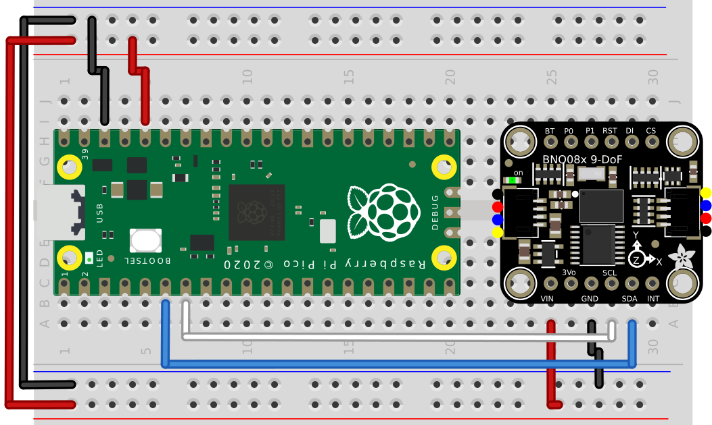

# BNO08x Raspberry Pi Pico RP2040 Library

This library is a refactoring of [Mark Mellors](https://github.com/markmellors)' work who made the BNO08x IMU compatible with the Raspberry Pi Pico RP2040 SDK. 

## Description

This library was designed to work in I2C with the BNO08x.
By default the i2c0 and the GP4 and GP5 are used in this project.


<p align="center" style="color:gray;">Raspberry Pi Pico connected using I2C to the BNO085 - Schematic created with Fritzing</p>

## Motivation

Initially developed for the [osod24_firmware](https://github.com/thingswebuilt/osod24_firmware) project, this library was originally tailored specifically to its requirements. There arose a need for a more generalized version to make this resource more widely accessible. <br>
This project remains the sole documentation I've encountered regarding the utilization of the BNO08x with the Raspberry Pi Pico, a resource not readily available elsewhere. Enhancing its accessibility could prove beneficial to others beyond just myself.

## Project Structure

The project is structured as follows:

```
BNO08x_Pico_Library
├── CMakeLists.txt
├── assets
├── include
│   ├── bno08x.h
│   └── utils.h
├── README.md
├── sh2
│   ├── CMakeLists.txt
│   ├── include
│   │   ├── NOTICE.txt
│   │   ├── sh2_err.h
│   │   ├── sh2.h
│   │   ├── sh2_hal.h
│   │   ├── sh2_SensorValue.h
│   │   ├── sh2_util.h
│   │   └── shtp.h
│   └── src
│       ├── sh2.c
│       ├── sh2_SensorValue.c
│       ├── sh2_util.c
│       └── shtp.c
└── src
    ├── bno08x.cpp
    └── utils.cpp
```

The specification of Raspberry Pi Pico pins used for I2C, with I2C0 being the default, and the ability to set the I2C baud rate, are defined in utils.h:
```
BNO08x_Pico_Library
└── include
    └── utils.h
```
## Requirements
- [piko-sdk](https://github.com/raspberrypi/pico-sdk)

## Installation

To use this library, clone the repository into your Raspberry Pi Pico RP2040 project directory:

```bash
git clone https://github.com/robotcopper/BNO08x_Pico_Library.git
```

Then include it in your project's CMakeLists.txt file:

```cmake
add_subdirectory(
	BNO08x_Pico_Library
)

target_link_libraries(main
    BNO08x_Pico_Library
)
```

## Usage

Here's a simple example demonstrating how to use the library to initialize the sensor and read orientation data:

```cpp
#include "bno08x.h"

i2c_inst_t* i2c_port0;
initI2C(i2c_port0, false);
//set up IMU
while (IMU.begin(CONFIG::BNO08X_ADDR, i2c_port0)==false) {
    printf("BNO08x not detected at default I2C address. Check wiring. Freezing\n");
    scan_i2c_bus();
    sleep_ms(1000);
}
IMU.enableRotationVector();

while (true) {

    float yaw = 0.0f;

    if (IMU.getSensorEvent() == true) {
        if (IMU.getSensorEventID() == SENSOR_REPORTID_ROTATION_VECTOR) {
            yaw = IMU.getYaw();
        }
    }

    printf("Yaw: %.2f rad\n", yaw);

}

```

## Credits and Contributions

1. **Original Developer: <br>
   &nbsp; SparkFun** :
   - Nathan Seidle @ SparkFun Electronics
   - Date: December 28, 2017

   &nbsp;&nbsp;&nbsp;&nbsp; **Adjustments** :
   - Pete Lewis @ SparkFun Electronics
   - Date: June 2023
   - To incorporate the CEVA Sensor Hub Driver: [CEVA SH2](https://github.com/ceva-dsp/sh2)

   &nbsp;&nbsp;&nbsp;&nbsp; **Links** :
   - Link to SparkFun_BNO08x_Arduino_Library GitHub repository: [SparkFun_BNO08x_Arduino_Library](https://github.com/sparkfun/SparkFun_BNO08x_Arduino_Library)

3. **Porting** :
   - **Use of External Code** :
        - Code from Adafruit BNO08x Arduino Library by Bryan Siepert for Adafruit Industries: [Adafruit_BNO08x](https://github.com/adafruit/Adafruit_BNO08x)
        - Use of I2C and SPI read/write functions and code from Adafruit BusIO library: [Adafruit_BusIO](https://github.com/adafruit/Adafruit_BusIO)
   - Ported by [Mark Mellors](https://github.com/markmellors) for use on RP2040
